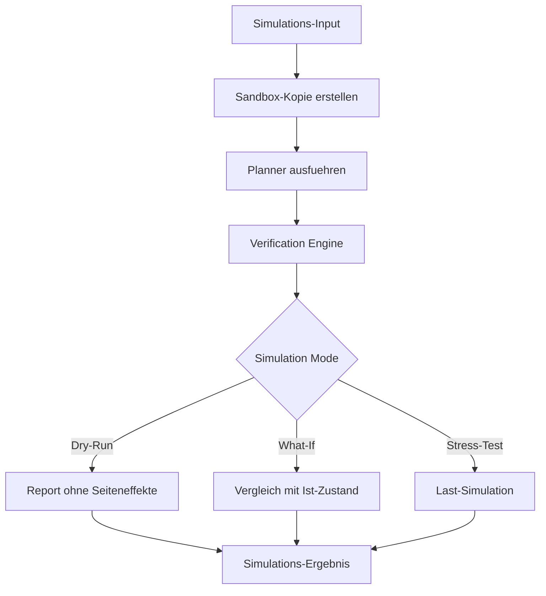

# NC-005 — Neuro Simulation Engine (Dry-Run)

## Zweck
Testet Entscheidungen ohne Ausfuehrung. Validiert neue Regeln, simuliert Edge Cases,
prueft Policies vor Rollout. Erweitert die bestehende Workflow-Simulation um Neuro-Core-spezifische Szenarien.

## Mermaid

## API

- `POST /api/v1/neuro/simulate` — Simulation ausfuehren
- `POST /api/v1/neuro/simulate/dry-run` — Dry-Run (keine Seiteneffekte)
- `GET /api/v1/neuro/simulate/{run_id}` — Ergebnis abrufen

## Status

| Slice | Beschreibung | Status |
|-------|-------------|--------|
| NC-005-A | Dry-Run Service + API | umgesetzt |
| NC-005-B | What-If Vergleich | umgesetzt |
