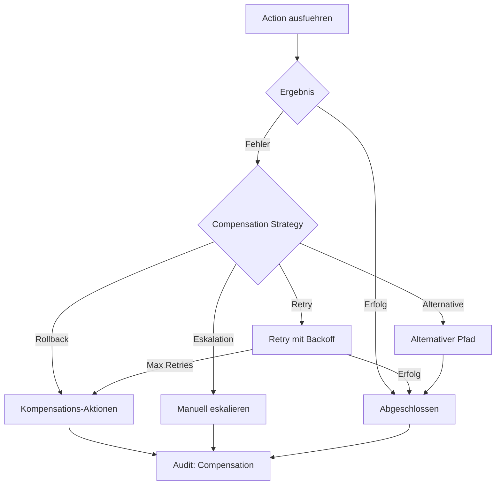

# NC-006 — Compensation Engine

## Zweck
Behandelt Fehler bei der Ausfuehrung: Rollback, Retry, alternative Pfade, Eskalation.
Verhindert inkonsistente Business-Zustaende bei Tool-Fehlern oder API-Ausfaellen.

## Mermaid

## Strategien

| Strategie | Beschreibung | Max Retries |
|-----------|-------------|-------------|
| retry_linear | Lineares Backoff (1s, 2s, 3s) | 3 |
| retry_exponential | Exponentielles Backoff (1s, 2s, 4s, 8s) | 5 |
| rollback | Kompensations-Aktionen rueckwaerts | - |
| alternative_path | Alternativen Workflow starten | 1 |
| escalate | An Mensch eskalieren | - |

## API

- `POST /api/v1/neuro/compensate` — Kompensation starten
- `GET /api/v1/neuro/compensate/{run_id}` — Status abrufen
- `POST /api/v1/neuro/compensate/{run_id}/retry` — Manueller Retry

## Status

| Slice | Beschreibung | Status |
|-------|-------------|--------|
| NC-006-A | Compensation Service + API | umgesetzt |
| NC-006-B | Retry-Strategien | umgesetzt |
| NC-006-C | Rollback-Ketten | umgesetzt |
