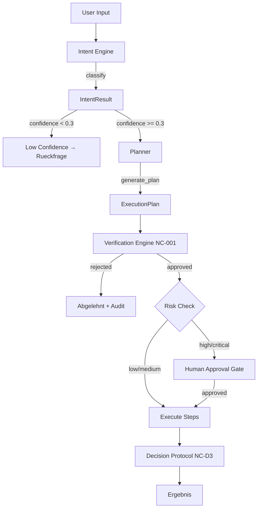

# NC-A — Neuro-Core Kernel (Intent Engine + Planner)

## Zweck
Kern-Lane des Neuro-Core: Klassifiziert User-Input in Intents, generiert ausfuehrbare Plaene
und verifiziert sie vor Ausfuehrung. Dockt an die bestehende NeuroASSIST-Capability-Registry an.

## Mermaid

## Intent-Klassifikation

| Intent | Kategorie | Capability | Risk |
|--------|-----------|-----------|------|
| bestellung_anlegen | command | bestellvorschlag_assistant | medium |
| skonto_pruefen | analysis | finance_skonto_assistant | low |
| compliance_pruefen | analysis | compliance_copilot | low |
| datenqualitaet_pruefen | analysis | data_quality_assistant | low |
| ausnahme_behandeln | command | operations_exception_assistant | high |
| system_optimieren | analysis | system_optimizer | low |
| auftrag_anlegen | command | — | medium |
| rechnung_erstellen | command | — | high |
| lagerbestand_abfragen | query | — | low |
| navigation | navigation | — | low |
| freigabe_erteilen | approval | — | high |

## Plan-Templates

Jeder Intent hat ein vordefiniertes Template mit typisierten Schritten:
- **validation** — Vorbedingungen pruefen
- **query** — Daten laden
- **command** — Aktion ausfuehren (mit optionalem Rollback)
- **gate** — Manuelle Freigabe
- **notification** — Benachrichtigung

## API

- `POST /api/v1/neuro/classify` — Intent klassifizieren
- `GET /api/v1/neuro/intents` — Unterstuetzte Intents listen
- `POST /api/v1/neuro/plan` — Plan generieren (ohne Ausfuehrung)
- `POST /api/v1/neuro/execute` — Vollstaendige Pipeline

## Status

| Slice | Beschreibung | Status |
|-------|-------------|--------|
| NC-A1 | IntentResult Contract | umgesetzt |
| NC-A2 | IntentEngine.classify() mit 11 Intents | umgesetzt |
| NC-A3 | PlanStep Contract + Planner.generate_plan() | umgesetzt |
| NC-A4 | Verification Engine Integration | umgesetzt |
| NC-A5 | Pipeline: Intent → Plan → Verify → Execute | umgesetzt |
