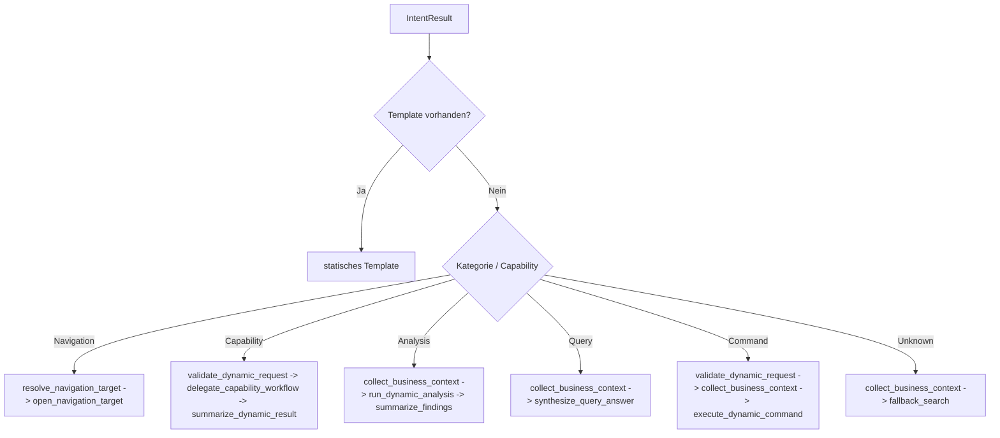

# NC-A10 - Dynamic Plan Generation

## Ziel

Templatefreie Intents sollen nicht mehr auf einen einzelnen `fallback_search`-Schritt kollabieren, sondern als mehrstufige Plaene nach Kategorie, Capability und Risiko aufgebaut werden.

## Ablauf

## Betroffene Dateien

- `app/agents/neuro_planner.py`
- `tests/test_neuro_planner.py`
- `tests/test_neuro_pipeline.py`

## Ergebnis

- `generate_plan()` erzeugt fuer templatefreie Intents jetzt heuristische Mehrschritt-Plaene
- Dynamic Steps tragen `_dynamic_plan`, `_intent_category` und `_source_intent` im Parameterblock
- Navigation und andere bekannte, aber untemplated Intents laufen nicht mehr ueber den Ein-Schritt-Fallback
