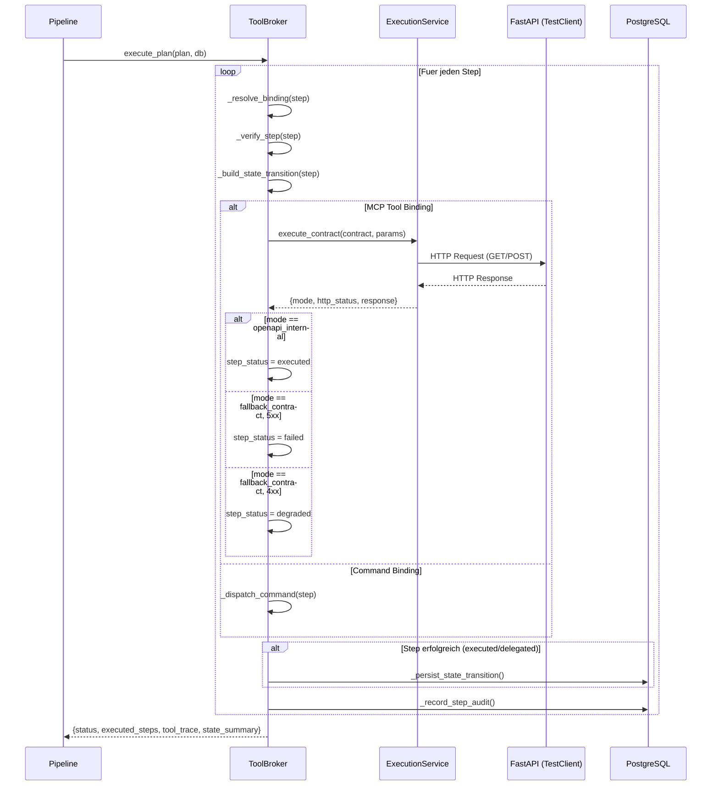

# NC-A7 — Broker OpenAPI Execution Adapter

## Ziel

Die MCP-Tool-Simulation im Neuro Tool Broker durch echte OpenAPI-Execution ersetzen, State-Graph-Mutationen nach Execution persistieren und per-Step Audit Traces schreiben.

## Vorbedingung

- NC-A6 (Neuro Tool Broker) abgeschlossen
- `NeuroToolExecutionService` in `app/services/neuro_tool_execution.py` vorhanden
- State-Graph-Modelle (`StateNodeRecord`, `StateTransitionRecord`) in DB-Schema `domain_shared`

## Ablauf

## Status

| Schritt | Status |
|---------|--------|
| Fallback-Handling (5xx/4xx/transport) | abgeschlossen |
| State-Graph-Persistenz nach Execution | abgeschlossen |
| Per-Step Audit Trace | abgeschlossen |
| Tests (13/13 gruen) | abgeschlossen |
| Card + Workflow-Doku | abgeschlossen |

## Naechste Schritte

→ Wave 2: Verification + Policy Integration
