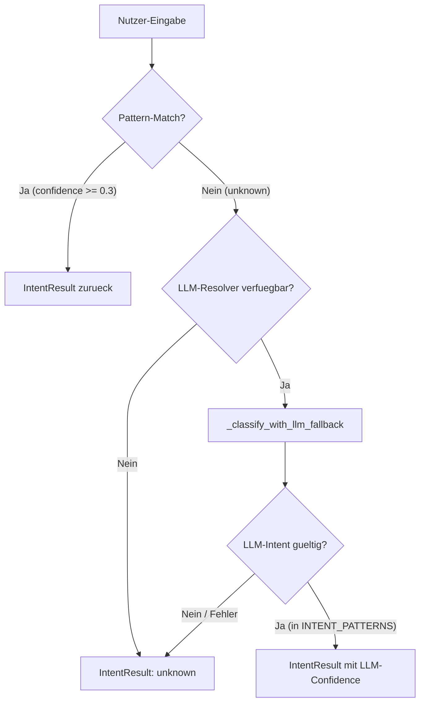

# NC-A9 — Intent Engine LLM-Fallback

## Ziel

Unbekannte Nutzeranfragen, die vom statischen Pattern-Matching nicht erkannt werden, ueber einen LLM-Fallback auf vorhandene Neuro-Intents mappen.

## Ablauf

## Resolver-Varianten

| Variante | Trigger | Beschreibung |
|----------|---------|--------------|
| Injected Resolver | `context["intent_llm_resolver"]` ist callable | Synchroner Callback, Test-freundlich |
| Service-basiert | `context["intent_llm_enabled"] = True` | Nutzt `generate_completion()` aus AI-Service |

## Betroffene Dateien

- `app/agents/neuro_intent_engine.py`
- `tests/test_neuro_intent_engine.py`
- `tests/test_neuro_pipeline.py`

## Ergebnis

- Unbekannte Eingaben koennen jetzt auf vorhandene Intents gemapped werden
- Safety: LLM darf keine neuen Intents erfinden, Confidence wird begrenzt
- Injected-Resolver-Pattern ermoeglicht einfaches Testing ohne echten LLM-Aufruf
