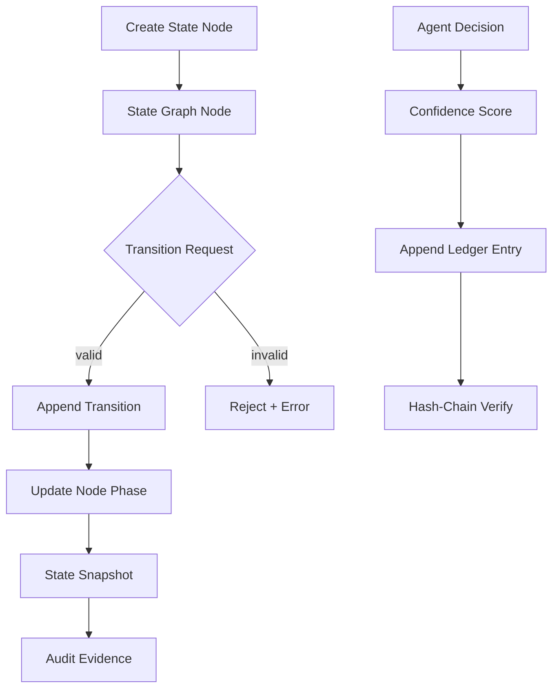

# NC-B1 -- State Graph + Confidence Ledger

## Zweck
Unified Business State Graph fuer Neuro-Core-Workflows plus Append-Only Confidence Ledger.
Die State Graph-Schicht macht Zustandsuebergaenge nachvollziehbar, die Ledger-Schicht
macht Risiko- und Konfidenzentscheidungen auditierbar und hash-verkettet.

## Mermaid

## Komponenten

| Komponente | Beschreibung |
|------------|-------------|
| StateNode | Business-Objekt mit Phase (Bestellung, Rechnung, Lager, etc.) |
| StateEdge | Beziehung zwischen Nodes (erzeugt, referenziert, folgt_auf) |
| StateTransition | Append-only Transition mit Kontext-Hash |
| ConfidenceLedgerEntry | Append-only Ledger-Eintrag (risk/confidence + hash-chain) |
| LedgerVerifier | Hash-Chain-Pruefung fuer Integritaet |
| Neuro State Graph API | CRUD/Transition/Read-Endpoints fuer State Graph + Ledger |

## API

- `POST /api/v1/neuro/state-graph/nodes`
- `GET /api/v1/neuro/state-graph/nodes`
- `POST /api/v1/neuro/state-graph/nodes/{id}/transitions`
- `GET /api/v1/neuro/state-graph/nodes/{id}/transitions`
- `POST /api/v1/neuro/state-graph/edges`
- `GET /api/v1/neuro/state-graph/meta/node-types`
- `POST /api/v1/neuro/confidence-ledger/entries`
- `GET /api/v1/neuro/confidence-ledger/entries`
- `POST /api/v1/neuro/confidence-ledger/verify`
- `GET /api/v1/neuro/confidence-ledger/summary`

## Status

| Slice | Beschreibung | Status |
|-------|-------------|--------|
| NC-B1-A | State Graph Modelle + Service | umgesetzt |
| NC-B1-B | REST API + DB-Modelle | umgesetzt |
| NC-B1-C | Confidence Ledger + Hash-Chain Verify | umgesetzt |
