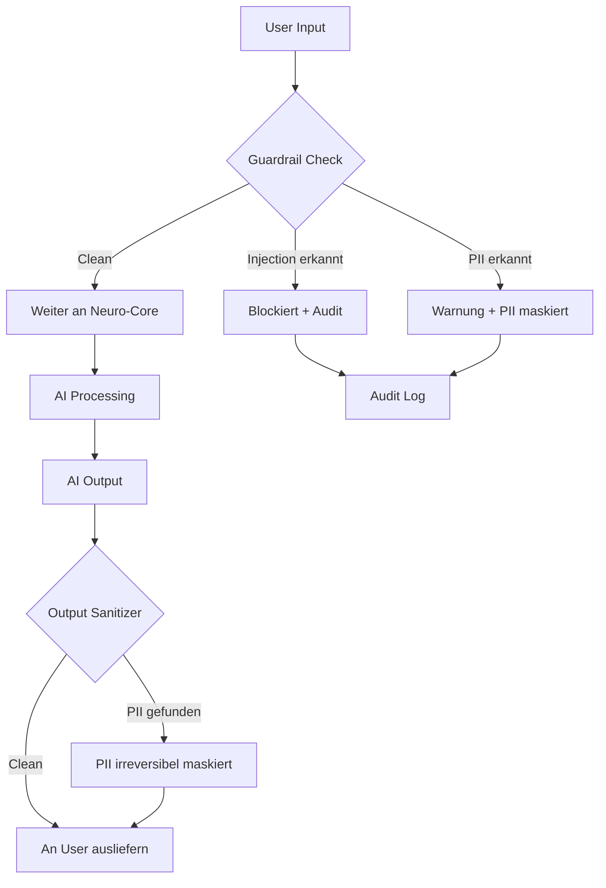

# NC-C — Guardrails + PII-Schutz + Consent

## Zweck
PII-Erkennung und -Maskierung auf allen AI-Ein-/Ausgaben.
Prompt-Injection-Erkennung als Input-Filter.
Schutz personenbezogener Daten (DSGVO) im gesamten Neuro-Core-Pfad.

## Mermaid

## PII-Typen

| Typ | Pattern | Beispiel |
|-----|---------|---------|
| email | RFC 5322 | max@example.de |
| iban | DE + 20 Ziffern | DE89 3704 0044 0532 0130 00 |
| phone_de | +49 / 0-Prefix | +49 171 1234567 |
| steuernummer | XX/XXX/XXXXX | 12/345/67890 |
| kreditkarte | 16 Ziffern | 4111-1111-1111-1111 |
| geburtsdatum | DD.MM.YYYY | 15.03.1990 |

## API

- `POST /api/v1/neuro/guardrails/check-input` — Input pruefen
- `POST /api/v1/neuro/guardrails/sanitize-output` — Output bereinigen
- `POST /api/v1/neuro/guardrails/detect-pii` — PII erkennen
- `POST /api/v1/neuro/guardrails/mask` — Irreversibel maskieren
- `POST /api/v1/neuro/guardrails/scan-dict` — Dict/JSON scannen

## Status

| Slice | Beschreibung | Status |
|-------|-------------|--------|
| NC-C1 | PII Detector (Regex + Pattern) | umgesetzt |
| NC-C2 | PII Masker (reversibel + irreversibel) | umgesetzt |
| NC-C3 | Guardrails (Injection Detection + Output Sanitizer) | umgesetzt |
