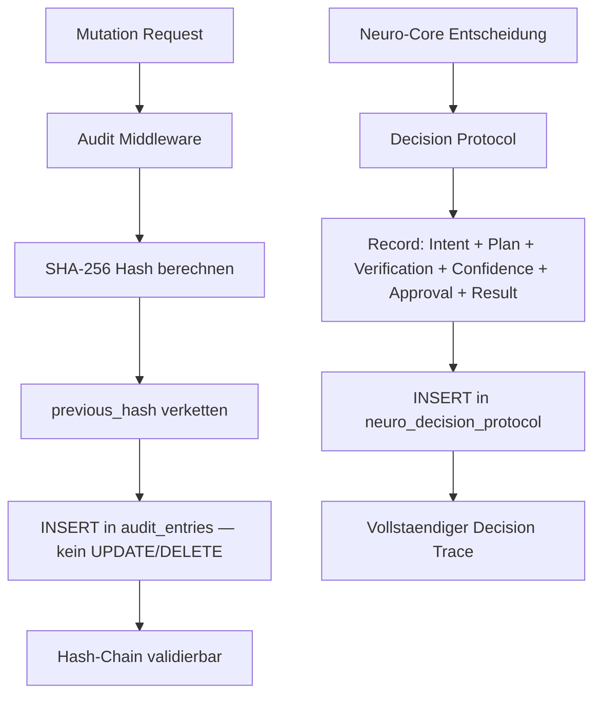

# NC-D — Audit Hardening + Decision Protocol

## Zweck
Persistentes Append-Only Audit-Schema mit Hash-Chain fuer GoBD-konforme Revisionssicherheit.
Neuro-Entscheidungs-Protokoll fuer jede AI-gesteuerte Aktion.
Vorbereitung fuer SIEM-Integration.

## Mermaid

## Komponenten

| Komponente | Beschreibung |
|------------|-------------|
| AuditEntry | Append-Only Tabelle mit Hash-Chain (previous_hash + SHA-256) |
| AuditMiddleware | Schreibt alle Mutationen (POST/PUT/PATCH/DELETE) in AuditEntry |
| NeuroDecisionProtocol | Protokolliert AI-Entscheidungen: Intent, Plan, Verification, Confidence, Approval, Result |
| AuditQueryAPI | GET /api/v1/audit/trail mit Hash-Chain-Validierung |

## API

- `GET /api/v1/audit/trail` — Audit-Trail mit optionaler Hash-Chain-Validierung
- `GET /api/v1/audit/trail/{aggregate_id}` — Trail fuer eine Entity
- `POST /api/v1/neuro/decisions` — Decision Protocol Record erstellen
- `GET /api/v1/neuro/decisions/{decision_id}` — Decision abrufen
- `GET /api/v1/neuro/decisions` — Decisions listen

## Status

| Slice | Beschreibung | Status |
|-------|-------------|--------|
| NC-D1 | AuditEntry Append-Only + Hash-Chain | umgesetzt |
| NC-D2 | AuditMiddleware DB-Write | umgesetzt |
| NC-D3 | NeuroDecisionProtocol + Record | umgesetzt |
