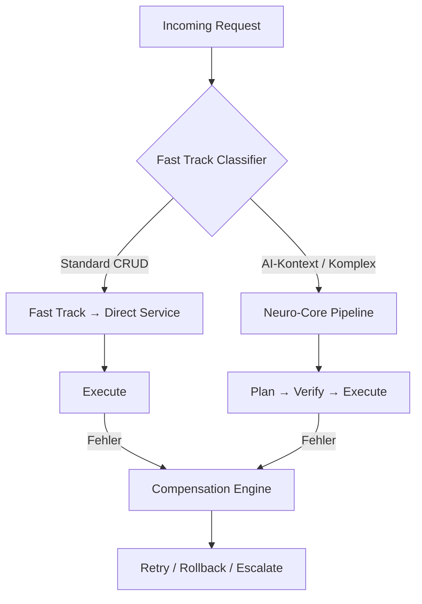

# NC-E — Fast Track + Compensation

## Zweck
Deterministischer Bypass fuer Standard-CRUD-Operationen ohne AI-Overhead.
Kombiniert mit der Compensation Engine (NC-006) fuer Fehlerbehandlung.

## Mermaid

## Whitelist-Regeln

| Regel | Beschreibung |
|-------|-------------|
| GET auf Stammdaten | Artikel, Lager, Kunden, Kontakte → immer Fast Track |
| POST/PUT auf Stammdaten | Wenn kein AI-Kontext → Fast Track |
| Neuro-Pfade | /api/v1/neuro/* → nie Fast Track |
| Finance Closing | /api/v1/finance/closing → nie Fast Track |
| AI-Kontext vorhanden | has_ai_context=true → immer Neuro-Core |

## API

- `POST /api/v1/neuro/fast-track/classify` — Request klassifizieren
- `GET /api/v1/neuro/fast-track/whitelist` — Aktuelle Whitelist
- `GET /api/v1/neuro/fast-track/check` — Schnellpruefung

## Status

| Slice | Beschreibung | Status |
|-------|-------------|--------|
| NC-E1 | FastTrackClassifier | umgesetzt |
| NC-E2 | Fast Track API | umgesetzt |
| NC-E3-E5 | Compensation (via NC-006) | umgesetzt |
