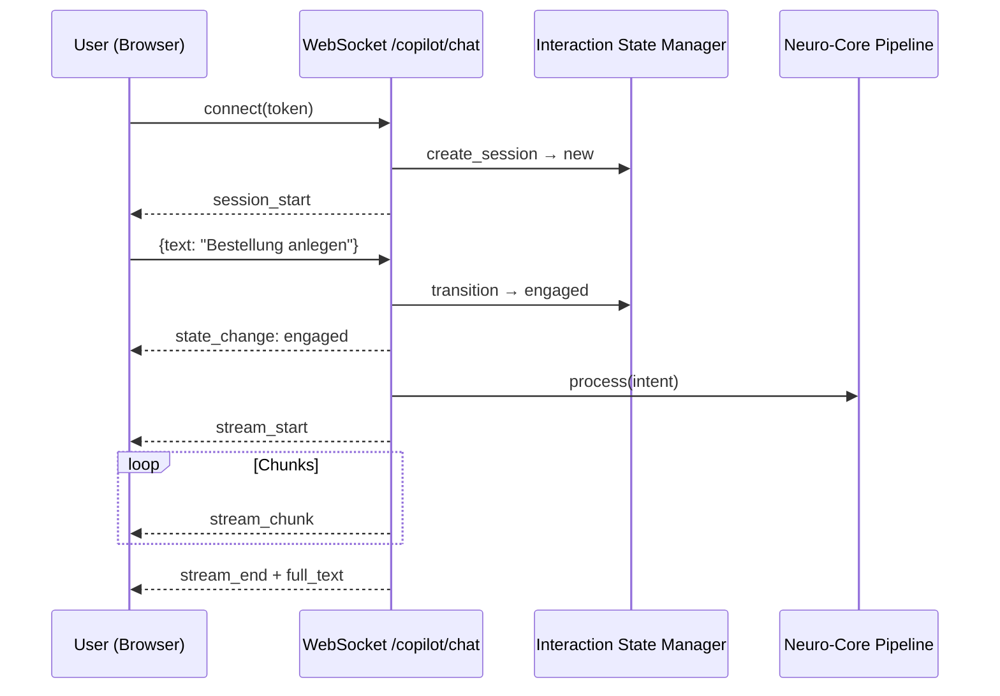

# NC-F — Copilot Backend + Interaction State

## Zweck
Echtzeit-AI-Streaming ueber WebSocket fuer den VALEO Copilot.
Chunked Response-Streaming mit Session-Management und Reconnect.

## Mermaid

## API

- `ws://host/api/v1/copilot/chat?token=...` — WebSocket-Endpoint
- Frontend: `useCopilotStream()` Hook mit connect/disconnect/send

## Status

| Slice | Beschreibung | Status |
|-------|-------------|--------|
| NC-F1 | Interaction State FSM (via NC-002) | umgesetzt |
| NC-F2 | InteractionStateManager transitions | umgesetzt |
| NC-F3 | WebSocket-Endpoint mit Streaming | umgesetzt |
| NC-F4 | useCopilotStream React Hook | umgesetzt |
| NC-F5 | Neuro-Core Pipeline Integration | wartet auf Lane A |
