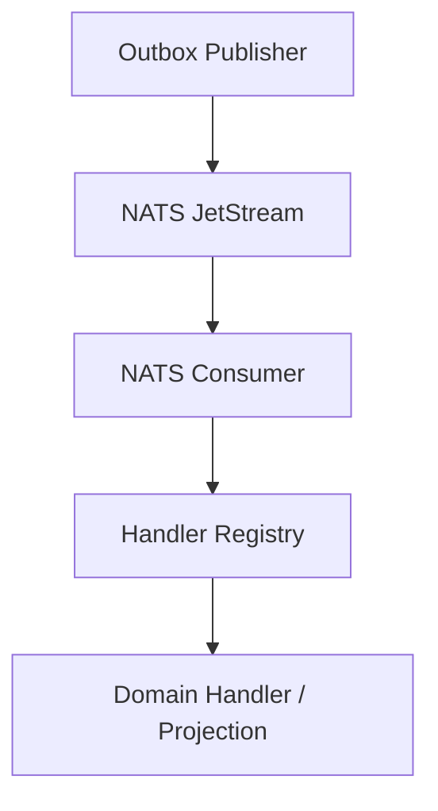

# NC-G2 -- NATS Consumer Framework

## Zweck
Ein generischer NATS-Consumer fuer das Event-Bus-System, der Events
verarbeitet, Handler registriert und sicher acked. Damit koennen
Outbox-Publisher, externe Systeme und interne Integrationen belastbar
Event-Driven reagieren.

## Mermaid

## Komponenten

| Komponente | Beschreibung |
|------------|-------------|
| NATSEventConsumer | NATS JetStream Consumer mit Handler-Registry |
| Handler Registry | Event-Type -> Handler (async) |
| Default Handler | Fallback fuer unbekannte Events |
| Ack/Nak | Erfolgs- oder Fehlerquittung |

## API / Nutzung

- `NATSEventConsumer.register_handler(event_type, handler)`
- `NATSEventConsumer.register_default_handler(handler)`
- `await NATSConsumer.start()` / `await NATSConsumer.stop()`

## Status

| Slice | Beschreibung | Status |
|-------|-------------|--------|
| NC-G2-A | Consumer Basis (Connect/Subscribe/Ack) | umgesetzt |
| NC-G2-B | Handler Registry + Dispatch | umgesetzt |
| NC-G2-C | Tests (Dispatch / Default) | umgesetzt |
