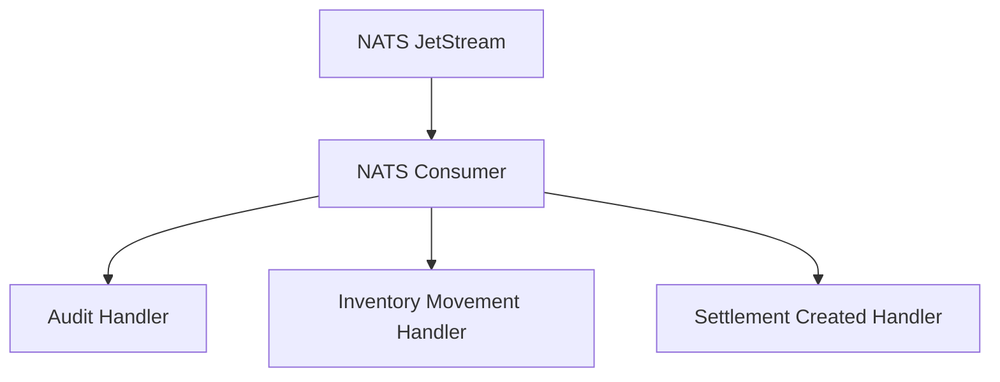

# NC-G3 -- NATS Consumer Handlers

## Zweck
Aktiviert drei baseline Event-Handler fuer Audit, Inventory und Settlement
auf dem NATS Consumer. Dient als Startpunkt fuer Event-Driven Reaktionen.

## Mermaid

## Handler

| Event | Handler | Aktion |
|-------|---------|--------|
| `audit.entry_created` | `handle_audit_event` | Schema-Validierung + Log |
| `inventory.movement_created` | `handle_inventory_movement_event` | Schema-Validierung + Log |
| `settlement.created` | `handle_settlement_created_event` | Schema-Validierung + Log |

## Status

| Slice | Beschreibung | Status |
|-------|-------------|--------|
| NC-G3-A | Handler-Registrierung | umgesetzt |
| NC-G3-B | Event-Validierung via Registry | umgesetzt |
| NC-G3-C | Tests | umgesetzt |
