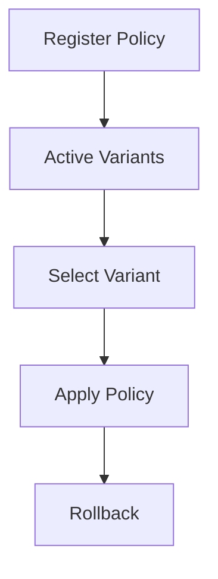

# NC-G4 -- Policy Registry Ausbau

## Zweck
Policy Registry um A/B-Varianten und Selektion erweitern. Damit kann
Policy-Testing kontrolliert ausgerollt werden, inkl. Rollback.

## Mermaid

## Komponenten

| Komponente | Beschreibung |
|------------|-------------|
| Policy Registry | Versionierte Policies (aktiv/inaktiv) |
| Variant Selector | Weighted Traffic Split per Variant |
| Rollback | Ruecksetzen auf vorherige Version |

## Status

| Slice | Beschreibung | Status |
|-------|-------------|--------|
| NC-G4-A | Variant-Registry + Auswahl | umgesetzt |
| NC-G4-B | API Erweiterung | umgesetzt |
| NC-G4-C | Tests | umgesetzt |
