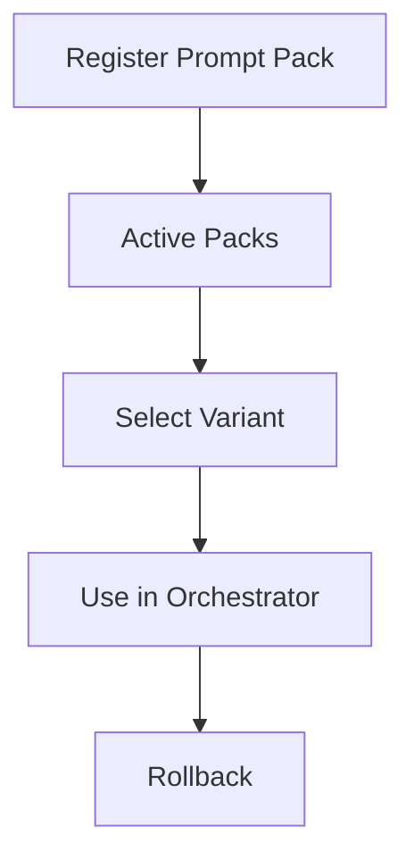

# NC-G5 -- Prompt Pack Registry

## Zweck
Versionierte Prompt Packs mit A/B-Varianten fuer NeuroASSIST.
Erlaubt kontrollierte Rollouts von Prompt-Packs pro Role/Capability.

## Mermaid

## Komponenten

| Komponente | Beschreibung |
|------------|-------------|
| PromptPack Registry | In-memory Registry fuer Versionen |
| Variant Selector | Weighted A/B Auswahl |
| Rollback | Ruecksetzen auf vorherige Version |

## Status

| Slice | Beschreibung | Status |
|-------|-------------|--------|
| NC-G5-A | Registry + Auswahl | umgesetzt |
| NC-G5-B | API Endpoints | umgesetzt |
| NC-G5-C | Tests | umgesetzt |
