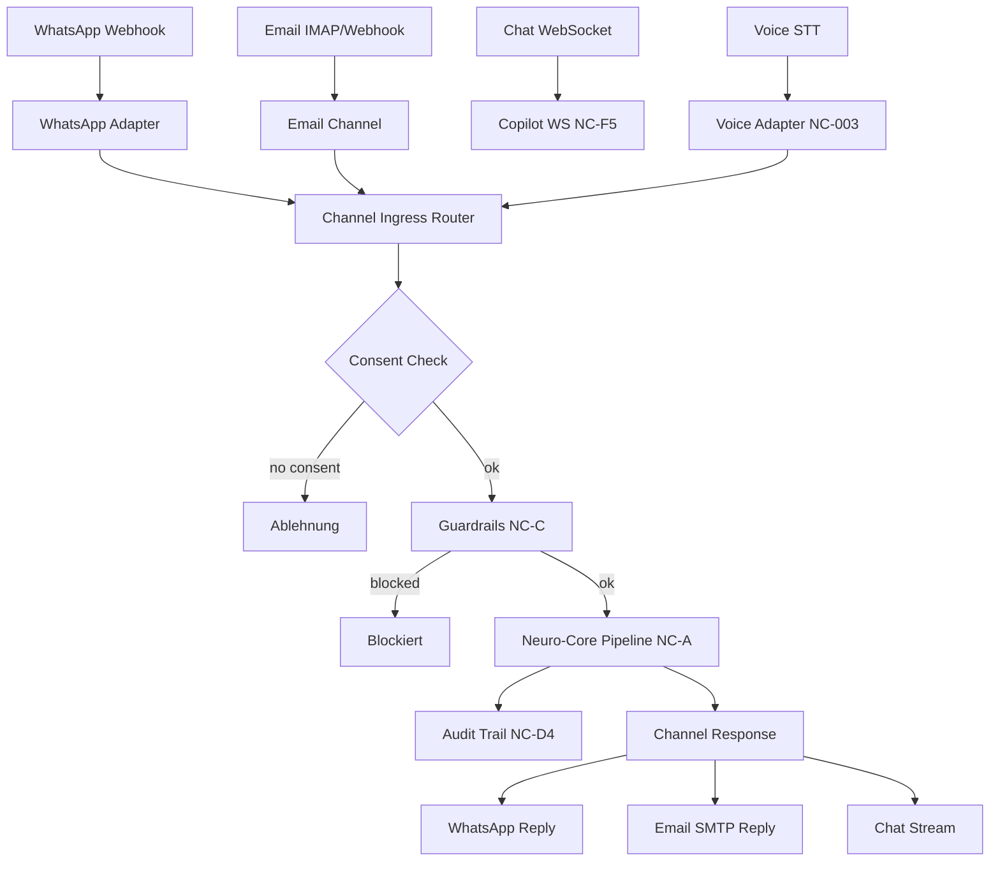

# NC-H — Channel Integration (WhatsApp, E-Mail, Voice, Generic)

## Zweck
Einheitlicher Eingang fuer alle Kommunikationskanaele. Jede eingehende Nachricht
wird ueber den Channel Ingress Router an die Neuro-Core Pipeline geroutet.
Consent-Pruefung, Guardrails und Audit-Trail sind integriert.

## Mermaid

## Kanaele

| Kanal | Adapter | Eingang | Ausgang | Status |
|-------|---------|---------|---------|--------|
| WhatsApp | `whatsapp_adapter.py` | Webhook POST | Text/Template Reply | umgesetzt (NC-H1) |
| E-Mail | `email_channel.py` | IMAP/Webhook | SMTP Reply | umgesetzt (NC-H2) |
| Chat | `copilot_ws.py` | WebSocket | Stream Chunks | umgesetzt (NC-F5) |
| Voice | `voice_adapter.py` | STT | TTS | umgesetzt (NC-003) |
| Generisch | `channel_ingress.py` | REST POST | JSON Response | umgesetzt (NC-H4) |

## API

- `GET /api/v1/channels/whatsapp/webhook` — WhatsApp Verification
- `POST /api/v1/channels/whatsapp/webhook` — WhatsApp Incoming
- `POST /api/v1/channels/email/ingest` — E-Mail Ingress
- `POST /api/v1/channels/route` — Generischer Channel Router

## Status

| Slice | Beschreibung | Status |
|-------|-------------|--------|
| NC-H1 | WhatsApp Adapter (Webhook + Message Parsing + Reply) | umgesetzt |
| NC-H2 | Email Channel (Parse + Priority + Reply Builder) | umgesetzt |
| NC-H3 | Voice Adapter (STT/TTS) | umgesetzt (NC-003) |
| NC-H4 | Channel Ingress Router (Consent + Guard + Pipeline) | umgesetzt |
| NC-H5 | Channel -> Neuro-Core Audit Trail | umgesetzt (NC-D4) |
