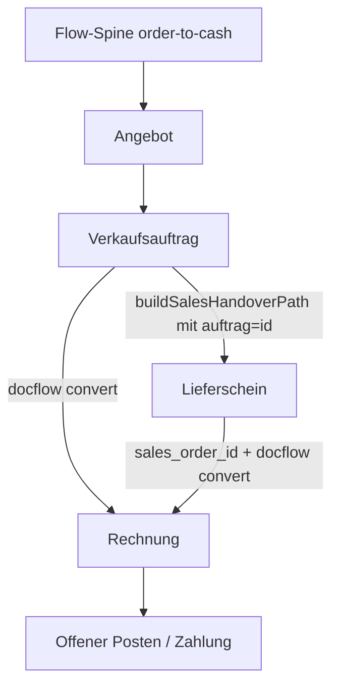

# OTC-010 - Order-to-Cash End-to-End Workflow

**Slice:** OTC-010 | **Lane:** Order-to-Cash | **Status:** abgeschlossen | **Owner:** Codex
**Aktualisiert:** 2026-06-26

## A - Uebersicht

Die Order-to-Cash Lane ist die zentrale Verkaufskette:
Angebot -> Verkaufsauftrag -> Lieferschein -> Rechnung -> Zahlung.

## B - Beteiligte Masken

| Schritt | Maske/Seite | Hauptaktion |
|---|---|---|
| 0 | `workflow/flow-spine-order-to-cash.tsx` | Prozessuebersicht und Deep-Links |
| 1 | `sales/angebot-erstellen.tsx` | Angebot anlegen und in Auftrag wandeln |
| 2 | `sales/order-editor.tsx` | Auftrag anlegen, speichern, in LS/Rechnung wandeln |
| 3 | `verkauf/lieferschein-erfassung.tsx` | Lieferschein aus Auftrag, drucken, buchen |
| 4 | `sales/invoice-editor.tsx` | Rechnung laden, speichern, drucken, exportieren |
| 5 | `sales/credit-note-editor.tsx` | Korrekturbeleg |

## C - Prozessfluss

## D - Handover-Vertrag

| Feld | Query | Zweck |
|---|---|---|
| `customerId` | `customerId` | CRM-Kunden-ID |
| `customerNumber` | `kunde` | Debitor/Kundennummer |
| `customerName` | `kundeName` | Anzeige-/Fallbackname |
| `sourceOfferId` | `angebot` | Angebotsbezug |
| `sourceOrderId` | `auftrag` | Auftragsbezug |
| `sourceDeliveryId` | `lieferschein` | Lieferscheinbezug |
| `invoiceId` | `rechnungId` oder `id` | Rechnungsbezug |
| `invoiceNumber` | `rechnungsnr` | Rechnungsnummer |

Die persistente Belegkette im Lieferschein nutzt das vorhandene Backend-Feld
`domain_sales.delivery_notes.sales_order_id`. Es wird kein paralleles
`source_order_id` eingefuehrt.

## E - Geschlossene Soll-Ist-Abweichungen

| # | Soll | Umsetzung |
|---|---|---|
| D-01 | Lieferschein liest `?auftrag=` und prefilled Kunden | `parseSalesHandover(searchParams)` + Kunden-Lookup |
| D-02 | Rechnung laedt bestehende Daten korrekt | `apiClient.get()` wird ueber `.data` entpackt |
| D-03 | Rechnung speichert neuen Beleg mit korrekter ID | Create extrahiert die Backend-ID korrekt |
| D-04 | `?auftrag=` uebergibt auch Positionen | `GET /api/v1/sales/orders/{id}` mappt `items` in `positionen` |
| D-05 | Lieferschein hat strukturierten Auftragsbezug | Payload sendet `sales_order_id` |
| D-06 | `/verkauf/rechnungen/<id>` oeffnet Edit-Modus | `invoice-editor.tsx` liest `useParams<{ id }>()` als Fallback |

## F - Technische Abnahme

- TypeScript: `pnpm.cmd --dir packages/frontend-web exec tsc --noEmit --pretty false` - gruen.
- Backend-Regression: `pytest -q -o addopts= tests/test_sales_o2c_001.py tests/test_sales_orders_api.py tests/test_sales_delivery_notes_api.py tests/test_docflow_conversion_order.py --maxfail=3` - 30 passed.

## G - Externe Gates

Repo-seitig ist OTC-010 geschlossen. Fuer Produktionsfreigabe bleiben die fachlichen UAT-Gates:

- Vertrieb/FiBu pruefen Auftrag -> Lieferschein -> Rechnung mit realistischen Belegnummern.
- Drucklayout und Archiv-/GoBD-Nachweis werden mit produktivem Formularsatz freigegeben.
- Zahlungseingang/Auszifferung bleibt in OTC-011/Finance-Prozesskette separat nachzuweisen.
