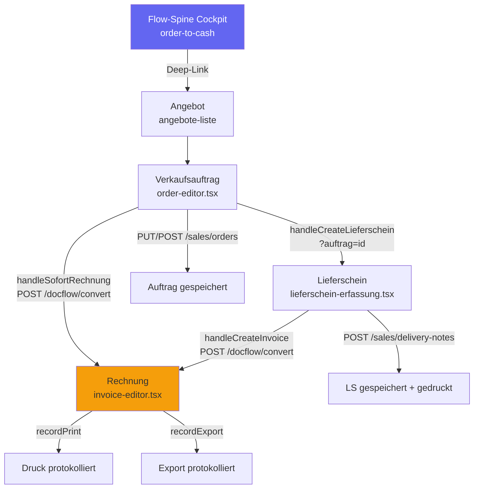

# OTC-010 — Order-to-Cash End-to-End Workflow-Analyse

**Slice:** OTC-010 | **Lane:** Order-to-Cash | **Status:** abgeschlossen | **Owner:** Claude Sonnet 4.6
**Datum:** 2026-03-27

---

## A — Übersicht

Die Order-to-Cash Lane (OTC) ist der zentrale Verkaufsprozess: vom Angebot über den Verkaufsauftrag, Lieferschein und Rechnung bis zur Zahlungserfassung. Sie entspricht der Flow-Spine `order-to-cash` im Registry und ist die umsatzkritischste Prozesskette im System.

### Beteiligte Masken

| Schritt | Maske/Seite | Hauptaktion |
|---|---|---|
| 0 | Flow-Spine Cockpit (`workflow/flow-spine-order-to-cash.tsx`) | Prozessübersicht, Instanz-Steuerung |
| 1 | Angebot (`sales/angebote-liste.tsx`, `sales/angebot-erstellen.tsx`) | Angebot anlegen |
| 2 | Verkaufsauftrag (`sales/order-editor.tsx`) | Auftrag anlegen, bestätigen, drucken |
| 3 | Lieferschein (`verkauf/lieferschein-erfassung.tsx`) | Lieferschein aus Auftrag, drucken, buchen |
| 4 | Rechnung (`sales/invoice-editor.tsx`) | Rechnung aus Lieferschein, drucken, verbuchen |
| 5 | Gutschrift (`sales/credit-note-editor.tsx`) | Korrekturbeleg |

---

## B — Karten-Übersicht

### Karte 1: Flow-Spine Cockpit
- `flow-spine-order-to-cash.tsx` rendert `<FlowSpineWorkspace processKey="order-to-cash" />`
- Steuert Instanzen, Statuskarten und Deep-Links in operative Masken
- Einstiegspunkt aus der Navigation für den Gesamtprozess

### Karte 2: Verkaufsauftrag (order-editor.tsx)
- Vollständige Auftragsmaske mit Customer-Selection, Positionstabelle, Versanddaten
- Workflow-Einstieg via `?workflowProcess=`, `?workflowInstanceId=`, `?workflowCase=`
- Handover zu Lieferschein: `handleCreateLieferschein()` → `/verkauf/lieferschein-erfassung?auftrag=<id>`
- Sofort-Rechnung: `handleSofortRechnung()` → `POST /api/v1/docflow/{id}/convert` → `/verkauf/rechnungen/<targetId>`
- `apiClient` von `@/lib/axios` (unwrapped, kein `.data` Bug)

### Karte 3: Lieferschein (lieferschein-erfassung.tsx)
- Vollständige LS-Maske mit Customer-Selection, Positionstabelle, Druck
- Sofort-Rechnung: `POST /api/v1/docflow/{id}/convert` → `/verkauf/rechnungen/<targetId>`
- **Handover-Gap (behoben):** `?auftrag=<id>` war ungelesen; jetzt `useSearchParams` + Kunden-Prefill
- `apiClient` von `@/lib/axios` (unwrapped)

### Karte 4: Rechnung (invoice-editor.tsx)
- FormBuilder-basierte Rechnung, `ApprovalPanel`, `BelegFlowPanel`
- Liest bestehende Rechnung via `GET /api/v1/docflow/{editId}`
- Speichert via `POST/PUT /api/v1/docflow`
- **`.data` Bug (behoben):** `apiClient` von `@/lib/api-client` (AxiosResponse), aber `.data` fehlte

---

## C — Prozessfluss (Mermaid)

---

## D — Soll-Ist-Abweichungen

| # | Soll | Ist | Bewertung |
|---|---|---|---|
| D-01 | Lieferschein liest Auftragsbezug `?auftrag=` und prefilled Kunden | War komplett ignoriert — kein `useSearchParams`, kein Prefill | **Behoben** in OTC-010 |
| D-02 | Rechnung lädt bestehende Daten korrekt (Edit-Mode) | `apiClient.get()` von `@/lib/api-client` → AxiosResponse, `.data` fehlte → alle Felder `undefined` | **Behoben** in OTC-010 |
| D-03 | Rechnung speichert neuen Beleg mit korrekt extrahierter ID | `created.id` statt `created.data.id` → `setDocId("undefined")` | **Behoben** in OTC-010 |
| D-04 | `?auftrag=` Prefill übergibt auch Positionen | Nur Kundendaten prefilled; Positionen bleiben leer | Offener Punkt OTC-010-P1 |
| D-05 | Lieferschein hat `sourceOrderId` Feld für Belegkette | Kein strukturiertes Feld, nur Kunde prefilled | Offener Punkt OTC-010-P2 |
| D-06 | Sofort-Rechnung navigiert zu `invoice-editor` | Navigiert zu `/verkauf/rechnungen/${targetId}` — separate Route, kein direkter Edit-Modus | Prüfbedarf OTC-010-P3 |
| D-07 | Flow-Spine Cockpit zeigt Instanz-Statuskarten live | `<FlowSpineWorkspace>` vollständig implementiert; abhängig von Backend-Instanzen | OK |

---

## E — UI/CRUD-Status

### order-editor.tsx (apiClient von @/lib/axios — unwrapped)
| Funktion | Status |
|---|---|
| Auftrag CRUD (GET/POST/PUT/DELETE) | OK |
| Kunden-Prefill aus CRM | OK |
| Workflow-Einstieg (searchParams) | OK |
| Lieferschein-Handover `?auftrag=` | OK (sendet korrekte URL) |
| Sofort-Rechnung per Docflow-Convert | OK |
| Print + Post-Flow | OK |

### lieferschein-erfassung.tsx (apiClient von @/lib/axios — unwrapped)
| Funktion | Status |
|---|---|
| LS CRUD (GET/POST/PUT/DELETE) | OK |
| `?auftrag=` Parameter lesen | Behoben (useSearchParams) |
| Kunden-Prefill aus Auftrag | Behoben |
| Sofort-Rechnung per Docflow-Convert | OK |
| Print + Post-Flow | OK |

### invoice-editor.tsx (apiClient von @/lib/api-client — AxiosResponse!)
| Funktion | Status |
|---|---|
| Rechnung laden (Edit-Mode) | Behoben (`.data` Extraktion) |
| Rechnung speichern — Create | Behoben (`created.data.id`) |
| Rechnung speichern — Update | OK (return-Wert nicht genutzt) |
| Druck protokollieren | OK (return-Wert nicht genutzt) |
| Export protokollieren | OK (return-Wert nicht genutzt) |

---

## F — Risiken

| Risiko | Schwere | Maßnahme |
|---|---|---|
| invoice-editor nutzt anderen apiClient als alle anderen Masken | Hoch | Behoben; Langfristig auf einheitlichen Client migrieren |
| Auftrag-Positionen werden nicht in Lieferschein übernommen | Mittel | OTC-010-P1 als Folgeslice |
| Sofort-Rechnung navigiert zu `/verkauf/rechnungen/` statt `invoice-editor` | Mittel | Route prüfen (OTC-010-P3) |
| `sourceOrderId` kein persistiertes Feld im LS | Niedrig | Backend-Erweiterung als OTC-010-P2 |

---

## G — Empfehlungen

1. **OTC-010-P1:** Positionsübernahme aus Auftrag in Lieferschein — `order.items` mappen und in `positionen` prefüllen
2. **OTC-010-P2:** `source_order_id` Feld im Lieferschein-Backend-Model für Belegketten-Tracking
3. **OTC-010-P3:** Prüfen ob `/verkauf/rechnungen/<id>` Route auf `invoice-editor.tsx` mit `?id=` weiterleitet
4. **OTC-011:** Zahlungseingangs-Flow — `POST /api/v1/finance/payment-runs` und Abstimmung gegen offene Rechnungen
5. **OTC-012:** Belegkette-Visualisierung im Flow-Spine Cockpit — Statuskarten Auftrag → LS → Rechnung → Zahlung live

## Status

**Erstanalyse abgeschlossen** (2026-03-27). P1-Empfehlungen (OTC-010-P1 bis P3) dokumentiert, OTC-011 separat umgesetzt.

## Update OTC-012 (2026-04-08)

- `packages/frontend-web/src/pages/verkauf/lieferschein-erfassung.tsx` liest jetzt den vorhandenen Aggregat-Endpoint `GET /api/v1/articles/{id}/position-context` und zeigt dazu ein sichtbares Artikel-Kontext-Panel mit Lagerorten, Zufuhr, Chargen sowie Kunden-/Einkaufspreishinweisen.
- Das Feld `verfuegbar` wird im Positionsbereich nicht mehr statisch mit `0` gehalten, sondern live aus `stock.total_available` des Kontext-Endpunkts befuellt.
- Die beim OTC-UI-Scan gefundenen toten Handler sind auf reale Zielpfade gezogen: CRM-Betriebsprofil, Field-Service-Neuanlage, Compliance-Register und Workflow-Supervisor statt leerer Klicks bzw. `coming soon`.
