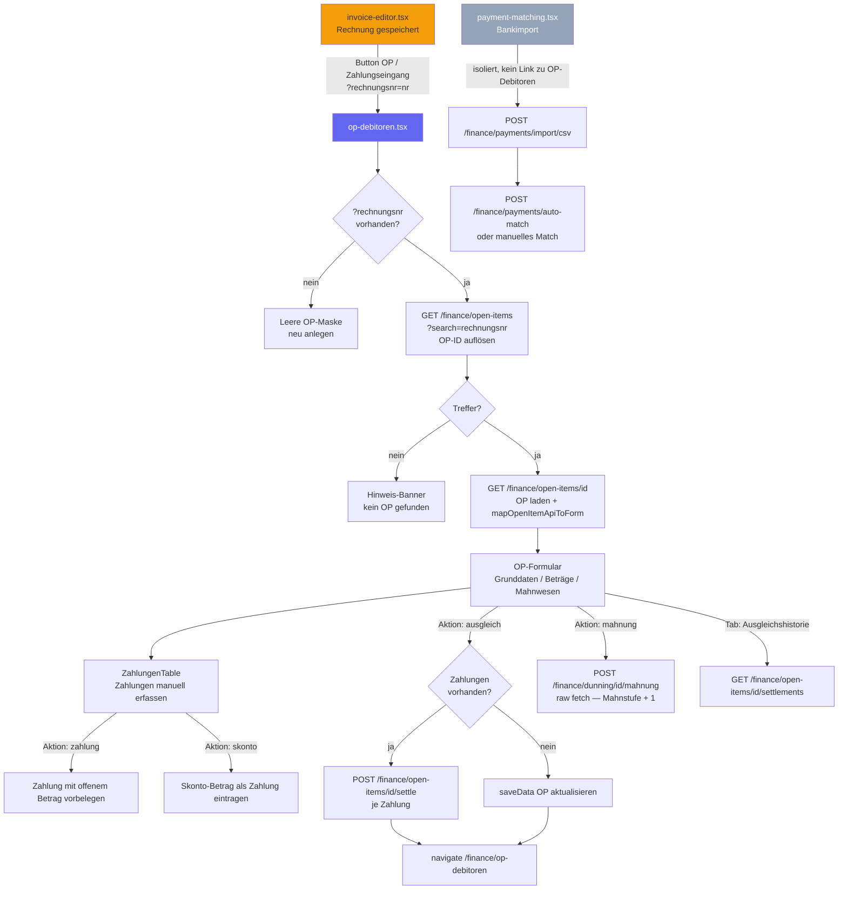

# OTC-011 — Zahlungseingang und Abstimmung

**Slice:** OTC-011 | **Lane:** Order-to-Cash (Folge) | **Status:** abgeschlossen | **Owner:** Claude Sonnet 4.6
**Datum:** 2026-03-27

---

## A — Übersicht

Folgeslice zu **OTC-010**: Nach Rechnungsstellung verbindet OTC-011 die Rechnung mit dem
Debitoren-OP und ermöglicht Zahlungserfassung, Skonto, Ausgleich und Mahnstufenerhöhung.
Zusätzlich existiert eine separate `payment-matching.tsx`-Seite für Bankimport und automatisches
Matching. Die beiden Flows sind derzeit nicht verknüpft (offener Punkt OTC-011-P4).

### Beteiligte Masken

| Schritt | Datei | Hauptaktion |
|---|---|---|
| 4 | `sales/invoice-editor.tsx` | Button „OP / Zahlungseingang” — Deep-Link |
| 5 | `finance/op-debitoren.tsx` | OP laden, Zahlungen erfassen, Ausgleich buchen |
| 5b | `finance/payment-matching.tsx` | Bankimport CSV + Auto-Matching (isoliert) |

---

## B — Vollständige Card-Liste

1. `OTC-011-C1` Deep-Link von `invoice-editor` nach `/finance/op-debitoren?rechnungsnr=`
2. `OTC-011-C2` OP per Rechnungsnummer auflösen (`GET /finance/open-items?search=`)
3. `OTC-011-C3` Zahlungen manuell in `ZahlungenTable` erfassen (Zahlung, Skonto, Gutschrift, Storno)
4. `OTC-011-C4` Ausgleich buchen: jede Zahlung als `POST /finance/open-items/{id}/settle`
5. `OTC-011-C5` Ausgleichshistorie lesen: `GET /finance/open-items/{id}/settlements`
6. `OTC-011-C6` Mahnstufe erhöhen: `POST /finance/dunning/{id}/mahnung`
7. `OTC-011-C7` Bankimport + Auto-Matching: `payment-matching.tsx` (eigenständige Seite)

---

## C — Mermaid-Diagramm

---

## D — Soll-Ist-Abweichungen

| # | Soll | Ist nach OTC-011 | Bewertung |
|---|---|---|---|
| D-01 | Rechnung verlinkt direkt in Debitoren-OP | Button „OP / Zahlungseingang” navigiert mit `?rechnungsnr=` | behoben |
| D-02 | OP per Rechnungsnummer gefunden, nicht per manueller ID-Eingabe | `GET /open-items?search=` + exakter Match, Fallback auf erstes Ergebnis | behoben |
| D-03 | Zahlungen manuell erfassbar (Zahlung, Skonto, Gutschrift) | `ZahlungenTable` mit Edit/Add/Remove; offener Betrag wird live berechnet | behoben |
| D-04 | Ausgleich persistiert Zahlungen im Backend | `POST /open-items/{id}/settle` je Zahlung; Storno-Typ wird übersprungen | behoben |
| D-05 | Ausgleichshistorie lesbar | Tab „Ausgleichshistorie” mit `GET /open-items/{id}/settlements` | behoben |
| D-06 | Debitor-Auswahl aus CRM | Dropdown hardcoded: K001/K002/K003, nicht aus `GET /crm/customers` | offen OTC-011-P1 |
| D-07 | Mahnung nutzt einheitlichen `apiClient` | Mahnung-Aktion nutzt `raw fetch()` mit `localStorage.getItem('token')` | offen OTC-011-P2 |
| D-08 | Nach Ausgleich zu OP-Liste navigieren | `navigate('/finance/op-debitoren')` führt zu leerer Einzel-Maske | offen OTC-011-P3 |
| D-09 | Bankimport und manuelle OP-Erfassung verbunden | `payment-matching.tsx` und `op-debitoren.tsx` vollständig isoliert | offen OTC-011-P4 |
| D-10 | `payment-matching.tsx` apiClient korrekt | Nutzt `@/lib/api-client` mit korrekter `{ data }` Destrukturierung | ok |

---

## E — UI/CRUD-Status

### `invoice-editor.tsx` (`@/lib/api-client` — AxiosResponse, korrekt mit `.data`)

| Funktion | Status |
|---|---|
| Deep-Link „OP / Zahlungseingang” bei gespeicherter Rechnung | OK — navigiert mit `?rechnungsnr=` |
| Button nur sichtbar wenn `docId` vorhanden und `invoice.number` gesetzt | OK |
| `nextTypes = []` — kein Docflow-Folgebeleg für OP | Design-Entscheidung; OP ist kein Docflow-Beleg |

### `op-debitoren.tsx` (`@/lib/axios` — unwrapped, kein `.data`-Bug)

| Funktion | Status |
|---|---|
| `?rechnungsnr=` auflösen via `GET /open-items?search=` | OK |
| OP laden via `GET /open-items/{id}` + `mapOpenItemApiToForm` | OK |
| Zahlungen manuell erfassen (ZahlungenTable) | OK |
| Skonto-Zahlung vorbelegen | OK |
| Ausgleich buchen (`POST /settle`) | OK |
| Ausgleichshistorie (`GET /settlements`) | OK |
| Mahnung eskalieren | Partiell — raw fetch statt apiClient |
| Export (`POST /export/list`) | OK |
| Debitor-Dropdown | Lücke — hardcoded |

### `payment-matching.tsx` (`@/lib/api-client` — `.data` korrekt)

| Funktion | Status |
|---|---|
| Ungematchte Zahlungen laden | OK |
| CSV-Bankimport | OK |
| Match-Vorschläge laden | OK |
| Manuelles Match | OK |
| Auto-Match | OK |

---

## F — Risiken

### hoch

- `raw fetch()` in der Mahnung-Aktion liest `localStorage.getItem('token')` — in OIDC-Umgebungen
  wird das Token nicht unter dem Key `token` gespeichert. Mahnstufen-Erhöhung schlägt im
  Prod-Betrieb lautlos fehl.

### mittel

- Debitor-Dropdown mit drei Hardcode-Einträgen ist nicht produktionstauglich. Jeder OP der einem
  anderen Kunden gehört kann nicht korrekt erfasst werden.
- `navigate('/finance/op-debitoren')` nach Ausgleich landet auf leerer Maske — kein Feedback für
  den Sachbearbeiter ob der Ausgleich gespeichert wurde.

### niedrig

- `payment-matching.tsx` und `op-debitoren.tsx` sind vollständig isoliert. Bankabgleich und
  manuelle OP-Bearbeitung müssen manuell zwischen den Seiten koordiniert werden.

---

## G — Empfehlungen

1. **OTC-011-P1:** Debitor-Dropdown durch `GET /api/v1/crm/customers` ersetzen — analog
   Kunden-Prefill in `lieferschein-erfassung.tsx`.
2. **OTC-011-P2:** Mahnung-Aktion auf `apiClient.post(...)` von `@/lib/axios` umstellen —
   `raw fetch()` mit `localStorage.getItem('token')` entfernen.
3. **OTC-011-P3:** Nach Ausgleich zu `/finance/offene-posten` navigieren (Listenansicht) oder
   Bestätigungs-Toast mit OP-Nummer einblenden vor Seitenwechsel.
4. **OTC-011-P4:** `payment-matching.tsx` nach erfolgreichem Match auf
   `/finance/op-debitoren?opId=<matched_op_id>` weiterleiten.
5. **OTC-012:** Belegkette-Visualisierung — Auftrag → LS → Rechnung → OP → Zahlung als
   Timeline im Flow-Spine Cockpit.

---

*Erstellt von Claude Sonnet 4.6 — Slice OTC-011 — 2026-03-27*
