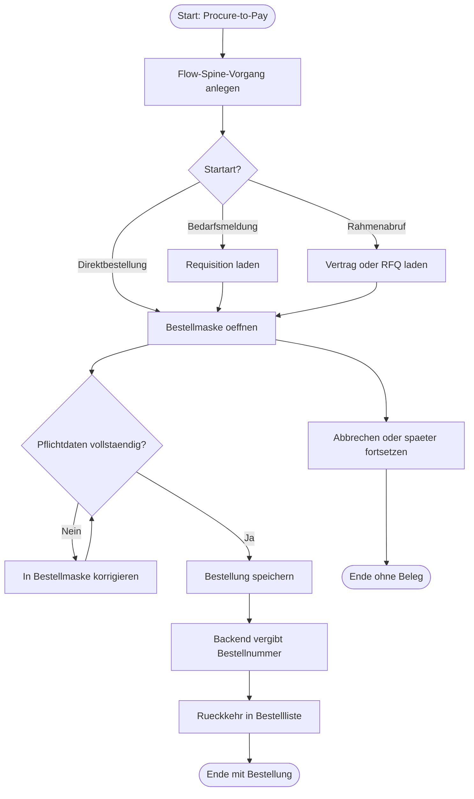

# P2P-001 - Procure-to-Pay Direktbestellung

## A. Workflow-Uebersicht

Gepruefter Workflow: `Procure-to-Pay`-Einstieg aus dem Flow Spine in die Standardmaske [`packages/frontend-web/src/pages/einkauf/bestellung-anlegen.tsx`](c:/Users/Jochen/VALEO-NeuroERP-3.0/packages/frontend-web/src/pages/einkauf/bestellung-anlegen.tsx).

Ziel ist ein belastbarer Direktstart fuer den Beschaffungsvorgang ohne neue Spezialmaske. Der Flow-Spine-Fall erzeugt zuerst einen Workflow-Vorgang mit Referenz und uebergibt danach Lieferant, Einstiegskontext und operative Notizen in die Bestellmaske. Fachliche Belegdaten werden erst in der Standardmaske erfasst.

Entscheidung `Standardmaske vor Spezialmaske`:

- Die bestehende Bestellmaske deckt Lieferant, Positionen, Liefertermin, Zahlungsbedingungen, Incoterms, Lieferadresse und Notizen bereits ab.
- Fuer diesen Slice ist keine Spezialmaske gerechtfertigt.
- Der priorisierte Ausbau betrifft Handover-Haertung und Mindestvalidierung, nicht einen neuen UI-Pfad.

## B. Vollstaendige Card-Liste

1. `P2P-010` Flow-Spine-Beschaffungsvorgang anlegen
   Flow-Spine-Fall mit `workflowInstanceId`, `workflowCase`, `workflowLabel`, `entryMode`, `partnerName` und `subject` erzeugen.
2. `P2P-020` Direktbestellung in Standardmaske erfassen
   Lieferant, Positionen, Mengen, Preise, Incoterms, Liefertermin, Lieferadresse und Notizen pflegen.
3. `P2P-030` Bestellung speichern und in Arbeitsliste uebergeben
   Bestellung ueber Backend anlegen, serverseitige Bestellnummer erhalten und zur Bestellliste zurueckkehren.
4. `P2P-040` Alternativpfad Bedarfsmeldung oder Rahmenabruf
   Requisition-, Vertrags- oder RFQ-Referenzen laden und Felder vorbefuellen.
5. `P2P-050` Wizard-Schrittvalidierung und Ruecksprung
   Eingaben validieren, Schrittwechsel blockieren, Ruecksprung und Korrektur absichern.

Detail-Card fuer den priorisierten Slice:

- [`docs/cards/einkauf/P2P-020-direktbestellung-standardmaske.md`](c:/Users/Jochen/VALEO-NeuroERP-3.0/docs/cards/einkauf/P2P-020-direktbestellung-standardmaske.md)

## C. Mermaid-Diagramm

## D. Soll-Ist-Abweichungen

| Card | Soll | Ist | Abweichung | Risiko | Massnahme |
|------|------|-----|------------|--------|-----------|
| `P2P-020` | Flow-Spine-Handover darf die Standardmaske stabil vorbefuellen. | Die Bestellmaske erzeugte vor diesem Slice bei vorhandenem Workflow-Kontext eine Render-Schleife, weil der Handover-Kontext pro Render neu aufgebaut wurde. | Workflow-Einstieg aus `Procure-to-Pay` war technisch instabil. | hoch | Workflow-Kontext memoizen und Handover-Pfad per Seitentest absichern. |
| `P2P-020` | Leere oder fachlich unbrauchbare Bestellungen duerfen nicht gespeichert werden. | Die Bestellmaske konnte vor diesem Slice ohne Lieferant oder valide Positionen abschliessen. | Fehlende Mindestvalidierung vor `POST /api/v1/purchase-orders`. | hoch | Frontend-Validierung beim Abschluss nachziehen und per Test absichern. |
| `P2P-020` | Lieferadresse aus der Standardmaske muss im Backend-Contract ankommen. | Frontend sendete `deliveryAddress`, Backend persistiert aber `shippingAddress`. | Lieferadresse ging im Belegfluss verloren. | hoch | Payload auf `shippingAddress` ausrichten; optional `deliveryAddress` als Compat-Feld weiterreichen. |
| `P2P-040` | Bedarfsmeldung, RFQ und Vertrag sollen Vorbelegung unterstuetzen. | Ladepfade sind vorhanden, aber nicht explizit workflow-dokumentiert und nicht testlich abgesichert. | Dokumentations- und QA-Luecke. | mittel | In Folge-Slice eigene Cards und Tests fuer Vorbelegungsvarianten nachziehen. |

## E. UI-/CRUD-Befunde

- `Create`: vorhanden, aber vor diesem Slice ohne belastbare Mindestvalidierung.
- `Read / Suchen`: Bestellliste unter `/einkauf/bestellungen` vorhanden.
- `Update`: Detailmaske fuer bestehende Bestellungen vorhanden.
- `Delete`: fachlich ueber Storno statt hartem Delete.
- `Statuswechsel`: Detailmaske unterstuetzt Freigabe und Storno.
- `Maskenuebergabe`: Workflow-Banner und URL-Handover sind vorhanden.
- `Sackgasse`: Vor diesem Slice konnte der Handover in eine Render-Schleife laufen; ausserdem konnte ein formal angelegter, fachlich leerer Entwurf entstehen.
- `Browser-Use`: Einstieg, Dateneingabe, Speichern, Rueckkehr in Liste und Handover-Banner sind pruefbar.

## F. Risiken

- `hoch`: Backend-Compat-Endpoint erzwingt Pflichtfelder nicht serverseitig. Dieser Slice haertet nur den Frontend-Pfad der Direktbestellung.
- `mittel`: Alternativpfade `requisitionId`, `contractId`, `rfqId` sind funktional vorhanden, aber noch nicht durch eigene Browser-Use-Checks dokumentiert.
- `niedrig`: Schrittvalidierung vor `Weiter` ist jetzt ueber `P2P-050` vorhanden; offen bleibt die weiterfuehrende Browser-Use-Dokumentation fuer alle Alternativpfade.
- `niedrig`: Workflow-Notizen werden aus Handover-Daten abgeleitet; fachliche Textpflege bleibt manuell.

## G. Konkrete Empfehlungen

1. Mindestvalidierung fuer Lieferant, Liefertermin und mindestens eine fachlich valide Position vor dem Speichern erzwingen.
2. Lieferadress-Feld auf denselben Backend-Contract wie Detail- und Listenpfade ausrichten.
3. In einem Folgeslice `P2P-040` separat auf Requisition-, Vertrags- und RFQ-Vorbelegung vertiefen.
4. Browser-Use-Pruefung fuer den Pfad `Flow Spine -> Bestellung anlegen -> Bestellliste` als lebende QA-Checkliste fortfuehren.

## Annahmen

- Der aktuelle Standardstart fuer den Slice ist `Direktbestellung`; Bedarfsmeldung und Rahmenabruf bleiben dokumentierte Alternativpfade.
- `shippingAddress` ist das kanonische Persistenzfeld des aktuellen Backend-Compat-Contracts.
- Serverseitige Pflichtfeldvalidierung ist in diesem Slice nicht vorhanden und wird deshalb nicht stillschweigend vorausgesetzt.
