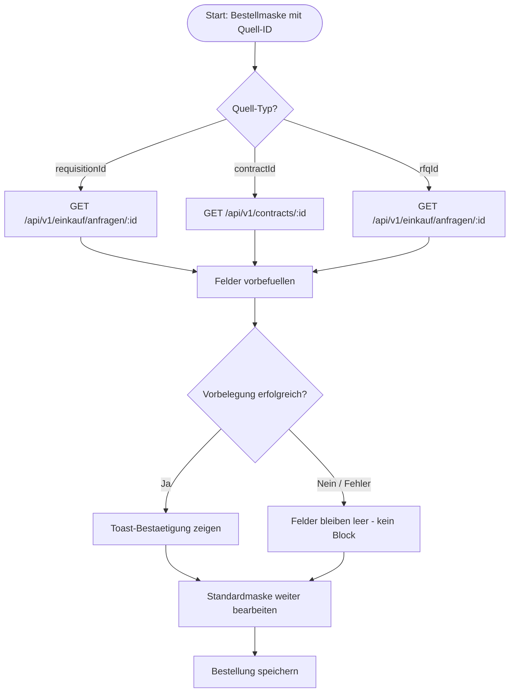

# P2P-040 - Procure-to-Pay Vorbelegung aus Bedarfsmeldung, Vertrag oder RFQ

## A. Workflow-Uebersicht

Gepruefter Workflow: Alternativpfade im `Procure-to-Pay`-Flow, bei denen eine Bedarfsmeldung (`requisitionId`), ein Rahmenvertrag (`contractId`) oder eine Lieferantenanfrage (`rfqId`) die Bestellmaske vorbefuellt.

Ziel ist ein belastbarer Alternativeinstieg, der die in P2P-001 gelegte Direktpfad-Grundlage um vorbelegte Alternativpfade erweitert. Felder werden serverseitig aus dem jeweiligen Quelle-Contract geladen und ohne Medienbruch in die Standardmaske uebernommen.

Entscheidung `Standardmaske vor Spezialmaske`:

- Die Bestellmaske deckt alle Vorbelegungs-Szenarien mit bestehenden Feldern ab.
- Keine neue Spezialmaske fuer Requisition, Vertrag oder RFQ gerechtfertigt.
- Der Ausbau betrifft Ladefunktionen, URL-Korrektheit, `.data`-Extraktion und Nutzer-Feedback.

## B. Vollstaendige Card-Liste

4. `P2P-040` Alternativpfad Bedarfsmeldung oder Rahmenabruf
   Requisition-, Vertrags- oder RFQ-Referenzen laden und Felder vorbefuellen.

Detail-Card:

- [`docs/cards/einkauf/P2P-040-vorbelegung-standardmaske.md`](c:/Users/Jochen/VALEO-NeuroERP-3.0/docs/cards/einkauf/P2P-040-vorbelegung-standardmaske.md)

## C. Mermaid-Diagramm

## D. Soll-Ist-Abweichungen

| Card | Soll | Ist | Abweichung | Risiko | Massnahme |
|------|------|-----|------------|--------|-----------|
| `P2P-040` | Requisition laed Artikel, Menge und Faelligkeit aus `/api/v1/einkauf/anfragen/:id`. | Vor diesem Slice fehlte `.data`-Extraktion; `apiClient.get` gibt `AxiosResponse<T>` zurueck, nicht direkt die Nutzdaten. | Felder wurden nie vorgefuellt; `req` war immer das Response-Objekt. | hoch | `.data`-Extraktion konsequent in allen drei Load-Funktionen nachziehen. |
| `P2P-040` | Contract-Endpoint liegt unter `/api/v1/contracts/:id`. | Vor diesem Slice wurde `/api/contracts/:id` verwendet (fehlendes `/v1/`). | 404 bei jedem Vertragsabruf. | hoch | URL auf `/api/v1/contracts/:id` korrigieren. |
| `P2P-040` | Nutzer erhaelt sichtbare Rueckmeldung bei erfolgreicher Vorbelegung. | Keine Toast-Bestaetigung vor diesem Slice. | Unklare UX: Nutzer weiss nicht, ob Vorbelegung erfolgreich war. | mittel | Toast nach erfolgreichem API-Load einfuegen. |
| `P2P-040` | Fehler beim Laden duerfen Bestellpfad nicht blockieren. | Try/catch vorhanden; Fehler werden jetzt zusaetzlich ueber Toasts sichtbar gemacht. | Keine verbleibende Kernabweichung im Ladefehlerpfad. | niedrig | Fehler-Toast als regressionsgesicherten Standard beibehalten. |

## E. UI-/CRUD-Befunde

- `Create`: vorhanden, mit Mindestvalidierung aus P2P-001.
- `Read / Suchen`: Vorbelegungs-Quellen werden per GET geladen; Bestellliste unter `/einkauf/bestellungen`.
- `Update`: Vorbelegte Felder sind nach dem Laden editierbar.
- `Delete`: fachlich ueber Storno.
- `Statuswechsel`: nicht Teil dieses Slice.
- `Maskenuebergabe`: URL-Parameter `requisitionId`, `contractId`, `rfqId` steuern Lad-Zweig.
- `Sackgasse`: Keine; bei API-Fehler bleibt Maske leer und benutzbar (Graceful Degradation).
- `Browser-Use`: Aufruf mit URL-Parametern, Vorbelegungs-Badges sichtbar, Felder editierbar, Speichern und Rueckkehr pruefbar.

## F. API-Contracts (Vorbelegung)

### Bedarfsmeldung `GET /api/v1/einkauf/anfragen/:id`

Felder die genutzt werden:
- `anfrageNummer` → `requisitionId` und Notizen
- `anforderer` → Notizen
- `artikel` → Positionsartikel
- `menge` → Positionsmenge
- `faelligkeit` → Liefertermin

### Vertrag `GET /api/v1/contracts/:id`

Felder die genutzt werden:
- `contractNo` → `contractId` und Notizen
- `supplierId` / `counterpartyId` → Lieferant
- `deliveryWindow.to` → Liefertermin
- `incoterms` → Incoterms
- `paymentTerms` → Zahlungsbedingung
- `commodity` → Positionsartikel
- `qty.contracted` / `qty.unit` → Positionsmenge/-einheit

### RFQ `GET /api/v1/einkauf/anfragen/:id`

Felder die genutzt werden:
- `anfrageNummer` → `rfqId` und Notizen
- `artikel` → Positionsartikel
- `menge` → Positionsmenge
- `faelligkeit` → Liefertermin
- `status` → Notizen (RFQ-Status)

## G. Risiken

- `mittel`: Requisition- und RFQ-Endpoint (`/api/v1/einkauf/anfragen/`) ist als Compat-Pfad vorhanden; abweichende Feldnamen oder unvollstaendige Anfragedaten fuehren weiterhin zu teilweiser Leer-Vorbelegung.
- `mittel`: Contract-Endpoint `/api/v1/contracts/:id` ist ueber den Compat-Layer verdrahtet; abweichende Feldnamen im Backend fuehren weiter zu leerer Vorbelegung ohne Fehlermeldung.
- `niedrig`: Vorbelegungs-Quellen koennen sich ueberlappen (z.B. `requisitionId` + `contractId` gleichzeitig); letzter Laden gewinnt wegen `prev`-Pattern im State.

## H. Konkrete Empfehlungen

1. Feldmapping der Compat-Endpoints gegen den kanonischen Workflow-Contract dokumentiert halten.
2. Browser-Use-Pfad fuer alle drei Vorbelegungs-Varianten in der QA-Checkliste fortschreiben.
3. Weitere Wizards auf dieselbe generische Schrittvalidierung pruefen.
4. VK-010 Harvest-Handover als naechsten Landhandel-Kernprozess fortschreiben.

## Annahmen

- `apiClient.get<T>()` gibt stets `AxiosResponse<T>` zurueck; `.data` ist der einzige korrekte Datenzugriff.
- Liefertermin aus Vertrag ist `deliveryWindow.to` (ISO-Date-String); andere Vertragsformate erfordern eigene Feldmapping-Ergaenzung.
- Requisition und RFQ teilen denselben Einkaufsanfrage-Endpoint; Differenzierung erfolgt ausschliesslich ueber den URL-Parameter-Typ.

## Status

**Erstanalyse abgeschlossen** — Vorbelegung Requisition/Vertrag/RFQ dokumentiert.
