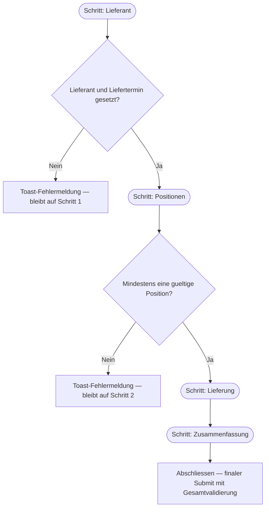

# P2P-050 - Procure-to-Pay Wizard-Schrittvalidierung

## A. Workflow-Uebersicht

Gepruefter Workflow: Schritt-fuer-Schritt-Validierung im Wizard `Bestellung anlegen`, die verhindert, dass ein Nutzer ohne gueltige Pflichtdaten auf den naechsten Schritt wechselt.

Ziel ist ein belastbarer Datenfluss im Wizard: Pflichtfelder werden gepruefte bevor der Nutzer weiternavigiert, statt erst beim finalen Abschluss. Die Entscheidung `Standardmaske vor Spezialmaske` bleibt unveraendert — es wird nur die bestehende Wizard-Infrastruktur (`getStepValidationError`-Prop) genutzt.

## B. Vollstaendige Card-Liste

5. `P2P-050` Wizard-Schrittvalidierung vor `Weiter`
   Jeder Schritt prueft eigene Pflichtdaten bevor der Nutzer weiternavigiert.

Detail-Card:

- [`docs/cards/einkauf/P2P-050-wizard-schrittvalidierung.md`](c:/Users/Jochen/VALEO-NeuroERP-3.0/docs/cards/einkauf/P2P-050-wizard-schrittvalidierung.md)

## C. Mermaid-Diagramm



## D. Soll-Ist-Abweichungen

| Card | Soll | Ist | Abweichung | Risiko | Massnahme |
|------|------|-----|------------|--------|-----------|
| `P2P-050` | `Weiter` auf Schritt 1 soll blockieren wenn Lieferant fehlt. | Vor diesem Slice war `getStepValidationError` nicht verdrahtet; `Weiter` navigierte ohne Pruefung. | Nutzer konnte leere Schritte durchklicken und erst beim Submit scheitern. | hoch | `validateStep(stepId)` an `getStepValidationError`-Prop uebergeben. |
| `P2P-050` | `Weiter` auf Schritt 2 soll blockieren wenn keine valide Position vorhanden. | Identisch mit obigem — keine Pruefung vor diesem Slice. | Gleicher Effekt: leere Positionen blieben bis zum Submit unentdeckt. | hoch | Position-Validierung in `validateStep('positionen')` eingebaut. |
| `P2P-050` | Fehlermeldung soll als Toast sichtbar sein. | `onStepValidationError` war unverdrahtet; kein User-Feedback. | Fehlermeldung waere lautlos ignoriert worden. | mittel | `onStepValidationError` zeigt Toast mit `variant: 'destructive'`. |

## E. Validierungsregeln pro Schritt

### Schritt `lieferant`
- `bestellung.lieferant` darf nicht leer sein.
- `bestellung.liefertermin` muss gesetzt sein.

### Schritt `positionen`
- Mindestens eine Position muss vorhanden sein.
- Jede Position benoetigt: `artikel` nicht leer, `menge > 0`, `preis >= 0`.

### Schritt `lieferung`
- Keine Pflichtfelder — Lieferadresse und Notizen sind optional.

### Schritt `zusammenfassung` (letzter Schritt)
- `Abschliessen` loest `handleSubmit` aus, der `validateBestellung()` als Sicherheitsnetz aufruft.

## F. Technische Umsetzung

Die `Wizard`-Komponente hat bereits eine `getStepValidationError`-Prop (synchron oder async, gibt `string | null` zurueck) und eine `onStepValidationError`-Prop fuer Fehler-Callbacks. In `bestellung-anlegen.tsx`:

```typescript
function validateStep(stepId: string): string | null {
  if (stepId === 'lieferant') {
    if (!bestellung.lieferant.trim()) return 'Lieferant ist ein Pflichtfeld.'
    if (!bestellung.liefertermin) return 'Liefertermin ist ein Pflichtfeld.'
  }
  if (stepId === 'positionen') {
    if (bestellung.positionen.length === 0) return 'Mindestens eine Position ist erforderlich.'
    const invalid = bestellung.positionen.find(
      (pos) => !pos.artikel.trim() || pos.menge <= 0 || pos.preis < 0
    )
    if (invalid) return 'Alle Positionen brauchen Artikel, Menge groesser 0 und einen nicht negativen Preis.'
  }
  return null
}
```

## G. Risiken

- `niedrig`: `validateBestellung()` beim Submit bleibt als Sicherheitsnetz erhalten; doppelte Validierung schadet nicht.
- `niedrig`: RFQ/Requisition-Vorbelegung kann `lieferant` noch leer lassen, wenn der API-Load noch nicht abgeschlossen ist; Nutzer muss den Lieferanten dann manuell ergaenzen.

## H. Annahmen

- Der `Wizard` navigiert nicht weiter wenn `getStepValidationError` einen String zurueckgibt.
- Schrittvalidierung ist synchron; asynchrone Validierung (z.B. Backend-Check) ist nicht Teil dieses Slice.
- Schritt `lieferung` und `zusammenfassung` haben keine Pflichtfelder und benoetigen keine eigene Validierungsfunktion.
