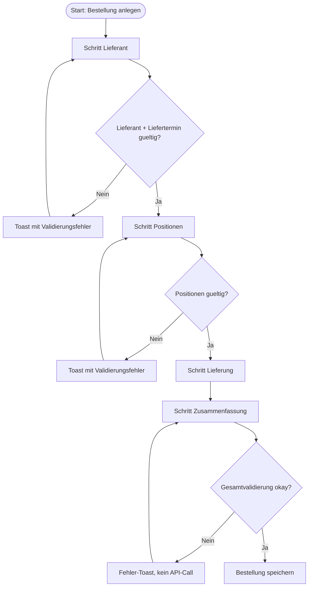

# P2P-050 - Procure-to-Pay Wizard-Schrittvalidierung

## A. Workflow-Uebersicht

Gepruefter Workflow: Schrittweiser Anlagepfad in [`bestellung-anlegen.tsx`](c:/Users/Jochen/VALEO-NeuroERP-3.0/packages/frontend-web/src/pages/einkauf/bestellung-anlegen.tsx) innerhalb des `Procure-to-Pay`-Wizards.

Ziel ist, dass Anwender nicht mehr mit fachlich leeren Lieferanten- oder Positionsschritten in spaetere Wizard-Schritte springen. Die Validierung bleibt in der Standardmaske und wird additiv ueber den Standard-Wizard verdrahtet.

Entscheidung `Standardmaske vor Spezialmaske`:

- Keine neue Einkaufs-Spezialmaske.
- Keine P2P-exklusive Wizard-Abspaltung.
- Schrittvalidierung wurde additiv im generischen [`Wizard.tsx`](c:/Users/Jochen/VALEO-NeuroERP-3.0/packages/frontend-web/src/components/patterns/Wizard.tsx) erweitert und in der Bestellmaske konfiguriert.

## B. Vollstaendige Card-Liste

1. `P2P-050` Lieferanten-Schritt validieren
   Lieferant und Liefertermin muessen vor `Weiter` vorhanden sein.
2. `P2P-051` Positions-Schritt validieren
   Mindestens eine fachlich gueltige Position muss vor `Weiter` vorhanden sein.
3. `P2P-052` Browser-Use-Checkliste fuer Wizard-Pfad fortschreiben
   Einstieg, Schrittwechsel, Ruecksprung und Abschluss muessen reproduzierbar beschrieben sein.

Detail-Card:

- [`docs/cards/einkauf/P2P-050-wizard-schrittvalidierung.md`](c:/Users/Jochen/VALEO-NeuroERP-3.0/docs/cards/einkauf/P2P-050-wizard-schrittvalidierung.md)

## C. Mermaid-Diagramm

## D. Soll-Ist-Abweichungen

| Card | Soll | Ist | Abweichung | Risiko | Massnahme |
|------|------|-----|------------|--------|-----------|
| `P2P-050` | Vor `Weiter` duerfen leere Pflichtschritte nicht passiert werden. | Vor diesem Slice konnte der Wizard trotz leerem Lieferanten- oder Positionsschritt voranschreiten. | Fehler wurden erst beim Abschliessen sichtbar. | hoch | Additive Schrittvalidierung im Standard-Wizard plus P2P-spezifische Regeln. |
| `P2P-051` | Positionen muessen vor Wechsel in spaetere Schritte fachlich brauchbar sein. | Leere Artikelzeilen konnten bis in die Zusammenfassung gelangen. | Unklare Prozessfuehrung und spaete Fehlererkennung. | hoch | Positionen vor `Weiter` auf Artikel, Menge > 0 und Preis >= 0 pruefen. |
| `P2P-052` | Browser-Use fuer den echten Wizard-Pfad soll dokumentiert sein. | QA-Checkliste war generisch, aber nicht P2P-konkreter Ablauf. | Restart-unscharf fuer manuelle Pruefung. | mittel | P2P-spezifische Browser-Use-Checkliste nachziehen. |

## E. UI-/CRUD-Befunde

- `Create`: vorhanden und jetzt zweistufig abgesichert: Schrittvalidierung plus Abschlussvalidierung.
- `Read / Suchen`: nicht Teil dieses Slices.
- `Update`: Ruecksprung in fruehere Schritte bleibt moeglich.
- `Delete`: fachlich ueber Abbruch oder spaeteren Storno.
- `Statuswechsel`: nicht Teil dieses Slices.
- `Maskenuebergabe`: Vorbelegung aus Flow Spine, Anfrage oder Vertrag bleibt erhalten und wird von der Schrittvalidierung respektiert.
- `Sackgasse`: keine; Nutzer bleibt im aktuellen Schritt und erhaelt einen Fehler-Toast.
- `Browser-Use`: Schrittweise Navigation, Ruecksprung, Validierungsblock und Abschluss sind explizit pruefbar.

## F. Risiken

- `mittel`: Andere Wizard-Nutzer koennen den neuen generischen Hook spaeter ebenfalls nutzen; deshalb muss die API additiv und rueckwaertskompatibel bleiben.
- `mittel`: Direkte Klick-Navigation auf spaetere Steps ist nur sicher, solange derselbe Validierungshook fuer Vorwaertsspruenge aktiv bleibt.
- `niedrig`: React-Router-Zukunftswarnungen bestehen weiterhin in den Tests, sind aber nicht Teil dieses Slices.

## G. Konkrete Empfehlungen

1. Generischen Wizard-Hook `getStepValidationError` fuer weitere fachliche Wizards wiederverwenden statt lokale Next-Button-Sonderlogik einzubauen.
2. P2P-Browser-Use-Checkliste bei jedem weiteren Alternativpfad-Slice mitpflegen.
3. Optional als naechsten Folgeschritt Fehler-Toast fuer fehlgeschlagene Vorbelegungs-Loads einfuehren.
4. Fuer andere prozesskritische Wizards pruefen, ob dieselbe Schrittvalidierung noetig ist.

## Annahmen

- Die Abschlussvalidierung in `handleSubmit()` bleibt der kanonische letzte Schutz vor dem API-Call.
- Ruecksprung in bereits durchlaufene Schritte soll weiterhin ohne erneute Sperre moeglich sein.
- P2P benoetigt vorerst nur Pflichtvalidierung fuer Lieferanten- und Positionsschritt; Lieferung bleibt optional.

## Status

**Erstanalyse abgeschlossen** — Wizard-Schrittvalidierung dokumentiert.
