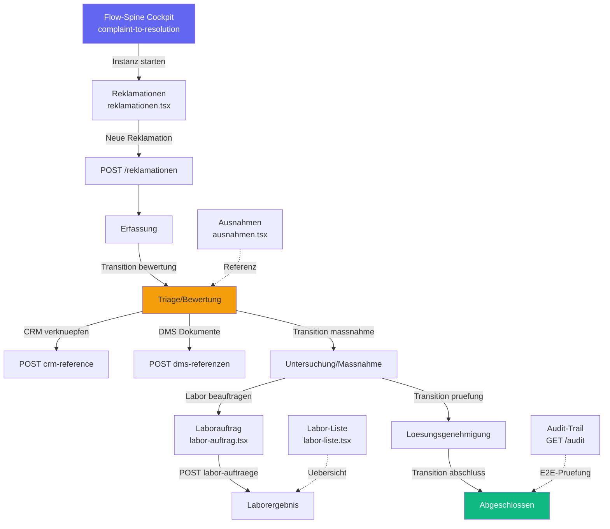

# REK-001 — Complaint-to-Resolution End-to-End Workflow-Analyse

**Slice:** REK-001 | **Lane:** Complaint-to-Resolution | **Status:** umgesetzt | **Owner:** Claude Opus 4.6
**Datum:** 2026-03-30

---

## A — Übersicht

Die Complaint-to-Resolution Lane deckt den Reklamationsprozess ab: Erfassung einer Beschwerde,
Triage/Bewertung, Untersuchung/Maßnahme, Lösungsgenehmigung und Abschluss. Im Landhandel
betrifft das Qualitätsreklamationen (Feuchtigkeit, Fremdbesatz, Mykotoxine), Lieferverzögerungen
und Abrechnungsdifferenzen.

### Beteiligte Masken

| Schritt | Datei | Hauptaktion |
|---|---|---|
| 1 | `workflow/flow-spine-complaint-to-resolution.tsx` | Cockpit mit FlowSpineWorkspace |
| 2 | `qualitaet/reklamationen.tsx` | Reklamationsliste + Neuanlage |
| 3 | `qualitaet/ausnahmen.tsx` | Ausnahmen-Register (Qualität) |
| 4 | `qualitaet/labor-auftrag.tsx` | Laborauftrag anlegen |
| 5 | `qualitaet/labor-liste.tsx` | Laboraufträge auflisten |

### Flow-Spine Steps (Registry)

`capture` → `triage` → `investigation` → `resolution` → `closure`

### Backend State Machine (reklamation_api.py)

`erfassung` → `bewertung` → `maßnahme` → `prüfung` → `abschluss`

---

## B — Vollständige Card-Liste

1. `REK-001-C1` Reklamation erfassen (Kunde, Artikel, Grund, Priorität)
2. `REK-001-C2` Reklamationsliste mit Statusfilter und CSV-Export
3. `REK-001-C3` Reklamation Triage/Bewertung (Status-Transition)
4. `REK-001-C4` CRM-Fallverknüpfung (POST crm-reference)
5. `REK-001-C5` DMS-Dokumente anhängen (POST dms-referenzen)
6. `REK-001-C6` Laborauftrag anlegen (Probenanalyse)
7. `REK-001-C7` Laboraufträge auflisten und Detail abrufen
8. `REK-001-C8` Ausnahmen-Register lesen
9. `REK-001-C9` Audit-Trail abrufen (E2E-Prüfung)
10. `REK-001-C10` Reklamation abschließen (Closure-Transition)
11. `REK-001-C11` Flow-Spine Cockpit (Instanzsteuerung, Statuskarten)

---

## C — Mermaid-Diagramm

---

## D — Soll-Ist-Abweichungen

| # | Soll | Ist nach REK-001 | Bewertung |
|---|---|---|---|
| D-01 | Reklamationsliste aus API | GET `/qualitaet/reklamationen` via `useReklamationen()` Hook — korrekt | ok |
| D-02 | Neue Reklamation anlegen | Button navigiert zu `/qualitaet/reklamation/neu` — Zielseite existiert | ok |
| D-03 | Reklamation Detail-Seite | `reklamation-detail.tsx` (698 Z.) — ObjectPage mit Tabs, GET Detail | ok (2026-03-30) |
| D-04 | Status-Transition UI | `VALID_TRANSITIONS` Map + Buttons in Detail-Seite | ok (2026-03-30) |
| D-05 | CRM-Fallverknuepfung | CRM-Tab mit POST-Mutation in Detail-Seite | ok (2026-03-30) |
| D-06 | DMS-Dokumentanhang | Dokumente-Tab mit POST-Mutation in Detail-Seite | ok (2026-03-30) |
| D-07 | Audit-Trail Viewer | Audit-Tab mit Integritaetspruefung in Detail-Seite | ok (2026-03-30) |
| D-08 | Laborauftrag anlegen | POST `/qualitaet/labor-auftraege` korrekt via `@/lib/api-client` | ok |
| D-09 | Laborliste lesen | GET `/qualitaet/labor-auftraege` via Hook — korrekt | ok |
| D-10 | Labor Detail-Seite | `labor-detail.tsx`, GET `/qualitaet/labor-auftraege/{id}`, Route `qualitaet/labor/:id` | ok (2026-03-30) |
| D-11 | Ausnahmen: apiClient | Nutzt `@/lib/api-client` mit korrekter `.data`-Extraktion | ok (2026-03-30) |
| D-12 | Flow-Spine: Auto-Instance | Best-effort Flow-Spine Transition in Detail handleTransition | ok (2026-03-30) |
| D-13 | Flow-Spine: State-Mapping | handleTransition sendet Status an Flow-Spine Instance | ok (2026-03-30) |
| D-14 | Flow-Spine: Instance-ID | `readWorkflowEntryContext(searchParams)` in Detail + Liste | ok (2026-03-30) |

---

## E — UI/CRUD-Status

### `reklamationen.tsx` (Hook `useReklamationen` aus `@/lib/api/misc-modules`)

| Funktion | Status |
|---|---|
| Liste mit Filter (GET) | OK |
| Neuanlage (Navigation) | OK |
| CSV-Export | OK |
| Detail/Edit | Fehlt — kein Detail-Route |
| Transition-Buttons | Fehlt |
| WorkflowEntryBanner | Vorhanden aber unvollständig |

### `ausnahmen.tsx` (`@/lib/axios` — Legacy)

| Funktion | Status |
|---|---|
| Liste lesen (GET) | Funktioniert mit Bug |
| `.data`-Extraktion | Bug — fehlt |
| Create/Update/Delete | Fehlt |

### `labor-auftrag.tsx` (`@/lib/api-client`)

| Funktion | Status |
|---|---|
| Laborauftrag anlegen (POST) | OK |
| Detail laden (GET/{id}) | Fehlt |
| Update/Delete | Fehlt |

### `labor-liste.tsx` (Hook `useLaborAuftraege`)

| Funktion | Status |
|---|---|
| Liste (GET) | OK |
| Detail-Link | Link vorhanden, Zielseite fehlt |

### Backend `reklamation_api.py`

| Funktion | Status |
|---|---|
| POST /reklamationen (Create) | OK |
| GET /reklamationen/{id} (Detail) | OK |
| POST /reklamationen/{id}/transition | OK |
| POST /reklamationen/{id}/crm-reference | OK |
| POST /reklamationen/{id}/dms-referenzen | OK |
| GET /reklamationen/{id}/audit | OK |
| GET /reklamationen/{id}/e2e | OK |
| GET /reklamationen/offene/{tenant} | OK |
| GET /reklamationen/ueberfaellige/{tenant} | OK |

---

## F — Risiken

### hoch

- **Kein Detail-/Transition-UI**: Die Reklamation kann erfasst aber nicht durch den Prozess
  gesteuert werden. Alle Backend-Endpoints (Transition, CRM, DMS, Audit) sind ungenutzt.
- **Flow-Spine komplett entkoppelt**: Reklamationen und Flow-Spine-Instanzen sind zwei
  getrennte Welten. Kein automatisches Instance-Create, kein State-Mapping.

### mittel

- **ausnahmen.tsx `.data`-Bug**: `apiClient.get()` gibt AxiosResponse zurück, Funktion
  erwartet Array direkt. Laufzeitfehler möglich.
- **API-Client Inkonsistenz**: 4 verschiedene Import-Muster in 5 Masken.

### niedrig

- **Labor Detail-Seite fehlt**: Link existiert, Ziel 404.

---

## G — Empfehlungen

1. **REK-001-P1:** Detail-Seite `/qualitaet/reklamation/{id}` erstellen (GET Detail + Tabs).
2. **REK-001-P2:** Transition-Buttons (erfassung → bewertung → ... → abschluss) in Detail-Seite.
3. **REK-001-P3:** CRM-Verknüpfung in Detail-Seite einbauen (POST `/crm-reference`).
4. **REK-001-P4:** DMS-Dokumentanhang in Detail-Seite einbauen (POST `/dms-referenzen`).
5. **REK-001-P5:** Audit-Trail Tab in Detail-Seite (GET `/audit`).
6. **REK-001-P6:** Labor Detail-Seite erstellen (`/qualitaet/labor/{id}`).
7. **REK-001-P7:** `ausnahmen.tsx` — `.data`-Extraktion + Import auf `@/lib/api-client` umstellen.
8. **REK-001-P8:** Reklamation-Create → automatisch Flow-Spine Instance anlegen.
9. **REK-001-P9:** Backend-Transition → Flow-Spine Node-Status synchronisieren.
10. **REK-001-P10:** `useSearchParams()` für `workflowInstanceId` in alle Masken einbauen.

---

*Erstellt von Claude Opus 4.6 — Slice REK-001 — 2026-03-27*

## Status

**Umgesetzt** (2026-03-30). Detail-UI mit Tabs, Labor-Detail (`/qualitaet/labor/:id`), Backend GET/POST Labor unter `/labor` und `/qualitaet`. Keine offenen REK-001-Punkte aus dieser Analyse.
