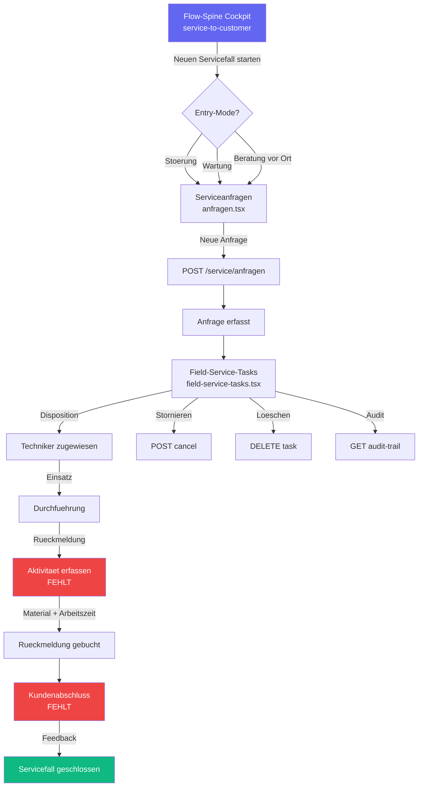

# SVC-001 — Service-to-Customer End-to-End Workflow-Analyse

**Slice:** SVC-001 | **Lane:** Service-to-Customer | **Status:** abgeschlossen | **Owner:** Claude Opus 4.6
**Datum:** 2026-03-27

---

## A — Übersicht

Die Service-to-Customer Lane deckt den Servicefall-Prozess ab: Kundenanfrage, Disposition/Planung,
Einsatz/Durchführung (Field Service), Rückmeldung/Abnahme und Kundenabschluss/Abrechnung.
Im Landhandel betrifft das Maschinenwartung, Störungsbehebung, Beratung vor Ort und
Serviceleistungen rund um Silo-/Lageranlagen.

### Beteiligte Masken

| Schritt | Datei | Hauptaktion |
|---|---|---|
| 1 | `workflow/flow-spine-service-to-customer.tsx` | Cockpit mit FlowSpineWorkspace |
| 2 | `service/anfragen.tsx` | Serviceanfragen-Liste + Neuanlage |
| 3 | `agribusiness/field-service-tasks.tsx` | Field-Service-Aufgaben (Disposition + Einsatz) |
| 4 | — (fehlt) | Rückmeldung/Aktivitäten |
| 5 | — (fehlt) | Kundenabschluss/Abrechnung |

### Flow-Spine Steps (Registry)

`request` → `planning` → `dispatch` → `report` → `closure`

---

## B — Vollständige Card-Liste

1. `SVC-001-C1` Serviceanfrage erfassen (Kunde, Betreff, Priorität, Entry-Mode)
2. `SVC-001-C2` Serviceanfragen-Liste mit Statusfilter und Suche
3. `SVC-001-C3` Flow-Spine Instanz starten (Störung/Wartung/Beratung)
4. `SVC-001-C4` Field-Service-Aufgabe zuweisen (Techniker, Route, Termin)
5. `SVC-001-C5` Field-Service-Aufgabe stornieren (POST cancel)
6. `SVC-001-C6` Field-Service-Aufgabe löschen (DELETE)
7. `SVC-001-C7` Field-Service Audit-Trail abrufen
8. `SVC-001-C8` Rückmeldung erfassen (Aktivität, Material, Arbeitszeit)
9. `SVC-001-C9` Kundenabschluss (Feedback, Closure)
10. `SVC-001-C10` Flow-Spine Cockpit (Instanzsteuerung, Statuskarten)

---

## C — Mermaid-Diagramm

---

## D — Soll-Ist-Abweichungen

| # | Soll | Ist nach SVC-001 | Bewertung |
|---|---|---|---|
| D-01 | Serviceanfragen-Liste | GET `/service/anfragen` via `useServiceAnfragen()` Hook — korrekt | ok |
| D-02 | Serviceanfrage Detail | Kein `/service/anfrage/{id}` Route — Link führt ins Leere | offen SVC-001-P1 |
| D-03 | Serviceanfrage anlegen | Kein `/service/anfrage/neu` Route — Button ohne Zielseite | offen SVC-001-P2 |
| D-04 | Serviceanfrage CRUD | Nur GET (Liste) — kein Create/Update/Delete im Frontend | offen SVC-001-P3 |
| D-05 | Field-Service-Tasks: Liste | GET via `fetch()` — funktioniert, aber nicht über apiClient | teilweise |
| D-06 | Field-Service-Tasks: apiClient | Nutzt native `fetch()` statt `apiClient`/React Query | offen SVC-001-P4 |
| D-07 | Field-Service-Tasks: Cancel/Delete | POST cancel + DELETE vorhanden | ok |
| D-08 | Field-Service-Tasks: Create/Edit | Buttons vorhanden, Navigation auskommentiert | offen SVC-001-P5 |
| D-09 | Field-Service-Tasks: Audit-Trail | GET audit-trail funktioniert | ok |
| D-10 | Rückmeldung/Aktivitäten | Keine Seite, kein Endpoint — Node `report` ist leer | offen SVC-001-P6 |
| D-11 | Kundenabschluss/Closure | Keine Seite, kein Endpoint — Node `closure` ist leer | offen SVC-001-P7 |
| D-12 | Service Domain Backend | Kein `/app/domains/service/` — Backend fehlt | offen SVC-001-P8 |
| D-13 | API-Endpunkt Mismatch | Registry verweist auf `/api/v1/crm/cases`, Frontend nutzt `/api/v1/service/anfragen` | offen SVC-001-P9 |
| D-14 | Flow-Spine: Instance-ID | Nur `anfragen.tsx` zeigt WorkflowEntryBanner, alle anderen ignorieren Instance | offen SVC-001-P10 |
| D-15 | Flow-Spine: Redirect | Workspace leitet korrekt auf `/service/anfragen?workflowInstanceId=...` | ok |

---

## E — UI/CRUD-Status

### `anfragen.tsx` (Hook `useServiceAnfragen` aus `@/lib/api/betrieb`)

| Funktion | Status |
|---|---|
| Liste mit Suche (GET) | OK |
| Card-Summary (Total, Neu, In Bearbeitung) | OK |
| WorkflowEntryBanner | OK |
| Detail-Seite | Fehlt |
| Neuanlage-Seite | Fehlt |
| Update/Delete | Fehlt |

### `field-service-tasks.tsx` (native `fetch()`)

| Funktion | Status |
|---|---|
| Liste (GET) | OK — via fetch() |
| Detail-Panel | OK — inline Sidebar |
| Cancel (POST) | OK |
| Delete (DELETE) | OK |
| Audit-Trail (GET) | OK |
| Create | Fehlt — Button auskommentiert |
| Edit | Fehlt — Button auskommentiert |
| apiClient-Integration | Fehlt — nutzt fetch() |
| Flow-Spine Link | Fehlt |

### Backend: Service Domain

| Funktion | Status |
|---|---|
| `/app/domains/service/` | Fehlt komplett |
| `/api/v1/service/anfragen` | Existiert (Endpunkt) |
| `/api/v1/service/anfragen/{id}` | Fehlt |
| `/api/v1/crm/activities` | Fehlt (für Rückmeldung) |

---

## F — Risiken

### hoch

- **2 von 5 Lanes komplett leer**: Rückmeldung (report) und Kundenabschluss (closure) haben
  weder Frontend-Seite noch Backend-Endpoint. Der Service-Prozess kann nicht zu Ende geführt werden.
- **Serviceanfrage nur Listenansicht**: Kein Detail, kein Create, kein Update — die Anfrage kann
  nicht bearbeitet werden.

### mittel

- **API-Endpunkt-Diskrepanz**: Registry verweist auf `/api/v1/crm/cases`, Frontend nutzt
  `/api/v1/service/anfragen`. Unklar welcher Endpunkt kanonisch ist.
- **Field-Service nutzt fetch()**: Keine zentralisierte Fehlerbehandlung, kein Auth-Token
  über Interceptor, kein Cache.
- **Service Domain Backend fehlt**: Kein `/app/domains/service/` Verzeichnis — Service ist
  kein eigenständiger Domain-Bereich.

### niedrig

- **Field-Service Create/Edit auskommentiert**: Buttons existieren aber Navigation fehlt.

---

## G — Empfehlungen

1. **SVC-001-P1:** Detail-Seite `/service/anfrage/{id}` erstellen.
2. **SVC-001-P2:** Create-Seite `/service/anfrage/neu` erstellen.
3. **SVC-001-P3:** CRUD-Hooks (Create/Update/Delete) für Serviceanfragen in `betrieb.ts`.
4. **SVC-001-P4:** `field-service-tasks.tsx` auf `apiClient` + React Query migrieren.
5. **SVC-001-P5:** Create/Edit Navigation in Field-Service einkommentieren.
6. **SVC-001-P6:** Rückmeldung-Seite erstellen (`/service/rueckmeldung` oder CRM-Aktivitäten).
7. **SVC-001-P7:** Kundenabschluss-Seite erstellen (`/service/abschluss`).
8. **SVC-001-P8:** Backend Service Domain anlegen (`/app/domains/service/`).
9. **SVC-001-P9:** API-Endpunkt klären: `/crm/cases` vs. `/service/anfragen` kanonisieren.
10. **SVC-001-P10:** `workflowInstanceId` in Field-Service + Rückmeldung durchreichen.

---

*Erstellt von Claude Opus 4.6 — Slice SVC-001 — 2026-03-27*

## Status

**Erstanalyse abgeschlossen** (2026-03-27). Service-to-Customer Flow-Spine aktiv, Slices dokumentiert.
