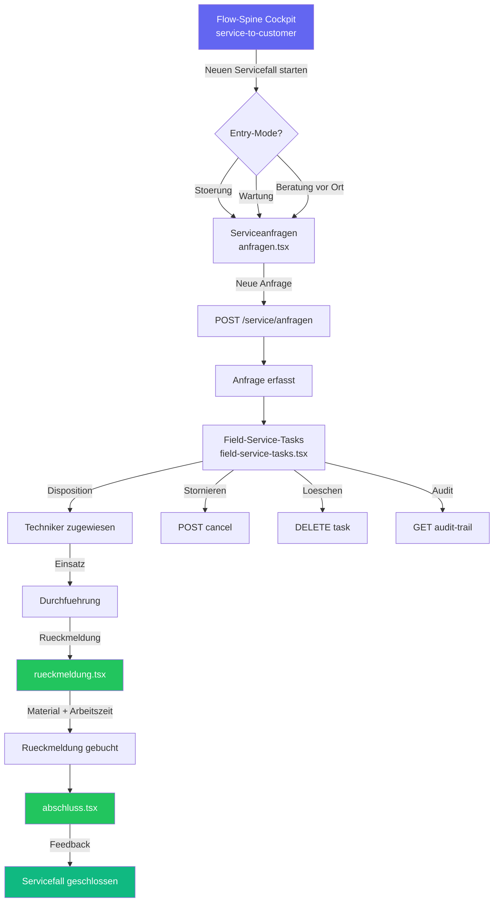

# SVC-001 — Service-to-Customer End-to-End Workflow-Analyse

**Slice:** SVC-001 | **Lane:** Service-to-Customer | **Status:** umgesetzt | **Owner:** Claude Opus 4.6
**Datum:** 2026-03-31

---

## A — Übersicht

Die Service-to-Customer Lane deckt den Servicefall-Prozess ab: Kundenanfrage, Disposition/Planung,
Einsatz/Durchführung (Field Service), Rückmeldung/Abnahme und Kundenabschluss/Abrechnung.
Im Landhandel betrifft das Maschinenwartung, Störungsbehebung, Beratung vor Ort und
Serviceleistungen rund um Silo-/Lageranlagen.

### Beteiligte Masken

| Schritt | Datei | Hauptaktion |
|---|---|---|
| 1 | `workflow/flow-spine-service-to-customer.tsx` | Cockpit mit FlowSpineWorkspace |
| 2 | `service/anfragen.tsx` | Serviceanfragen-Liste + Neuanlage |
| 3 | `agribusiness/field-service-tasks.tsx` | Field-Service-Aufgaben (Disposition + Einsatz) |
| 4 | `service/rueckmeldung.tsx` | Rückmeldung (report-Node) |
| 5 | `service/abschluss.tsx` | Kundenabschluss (closure-Node) |

### Flow-Spine Steps (Registry)

`request` → `planning` → `dispatch` → `report` → `closure`

---

## B — Vollständige Card-Liste

1. `SVC-001-C1` Serviceanfrage erfassen (Kunde, Betreff, Priorität, Entry-Mode)
2. `SVC-001-C2` Serviceanfragen-Liste mit Statusfilter und Suche
3. `SVC-001-C3` Flow-Spine Instanz starten (Störung/Wartung/Beratung)
4. `SVC-001-C4` Field-Service-Aufgabe zuweisen (Techniker, Route, Termin)
5. `SVC-001-C5` Field-Service-Aufgabe stornieren (POST cancel)
6. `SVC-001-C6` Field-Service-Aufgabe löschen (DELETE)
7. `SVC-001-C7` Field-Service Audit-Trail abrufen
8. `SVC-001-C8` Rückmeldung erfassen (Aktivität, Material, Arbeitszeit)
9. `SVC-001-C9` Kundenabschluss (Feedback, Closure)
10. `SVC-001-C10` Flow-Spine Cockpit (Instanzsteuerung, Statuskarten)

---

## C — Mermaid-Diagramm



---

## D — Soll-Ist-Abweichungen

| # | Soll | Ist nach SVC-001 | Bewertung |
|---|---|---|---|
| D-01 | Serviceanfragen-Liste | GET `/service/anfragen` via `useServiceAnfragen()` Hook — korrekt | ok |
| D-02 | Serviceanfrage Detail | `anfrage-detail.tsx` (293 Z.) — GET/PUT mit Tabs + Workflow-Banner | ok (2026-03-30) |
| D-03 | Serviceanfrage anlegen | `anfrage-neu.tsx` (158 Z.) — POST mit Workflow-Handover | ok (2026-03-30) |
| D-04 | Serviceanfrage CRUD | GET/POST/PUT/DELETE via `service_anfragen.py` + Frontend | ok (2026-03-30) |
| D-05 | Field-Service-Tasks: Liste | GET `/api/v1/agribusiness/field-service-tasks` via `apiClient` + `useQuery` | ok (2026-03-31) |
| D-06 | Field-Service-Tasks: Mutations | `useMutation` + Query-Invalidation; Backend in `compat.py` (CRM-Mapping + Demo-Fallback) | ok (2026-03-31) |
| D-07 | Field-Service-Tasks: Cancel/Delete | POST cancel + DELETE vorhanden | ok |
| D-08 | Field-Service-Tasks: Create/Edit | Routen `/agribusiness/field-service-tasks/neu` und `.../:id/bearbeiten` + API POST/PUT | ok (2026-03-31) |
| D-09 | Field-Service-Tasks: Audit-Trail | GET audit-trail funktioniert | ok |
| D-10 | Rueckmeldung/Aktivitaeten | `rueckmeldung.tsx` (177 Z.) — POST mit Arbeitszeit/Material/Ergebnis | ok (2026-03-30) |
| D-11 | Kundenabschluss/Closure | `abschluss.tsx` (163 Z.) — POST mit Star-Rating + Kommentar | ok (2026-03-30) |
| D-12 | Service Domain Backend | `service_anfragen.py` — Full CRUD + Rueckmeldung + Abschluss | ok (2026-03-30) |
| D-13 | API-Endpunkt Mismatch | Frontend nutzt `/api/v1/service/anfragen` kanonisch | ok (2026-03-30) |
| D-14 | Flow-Spine: Instance-ID | `readWorkflowEntryContext` in Detail, Neu, Rueckmeldung, Abschluss | ok (2026-03-30) |
| D-15 | Flow-Spine: Redirect | Workspace leitet korrekt auf `/service/anfragen?workflowInstanceId=...` | ok |

---

## E — UI/CRUD-Status

### `anfragen.tsx` (Hook `useServiceAnfragen` aus `@/lib/api/betrieb`)

| Funktion | Status |
|---|---|
| Liste mit Suche (GET) | OK |
| Card-Summary (Total, Neu, In Bearbeitung) | OK |
| WorkflowEntryBanner | OK |
| Detail-Seite | OK — `anfrage-detail.tsx` |
| Neuanlage-Seite | OK — `anfrage-neu.tsx` |
| Update/Delete | OK — via API |

### `field-service-tasks.tsx` (`apiClient` + TanStack Query)

| Funktion | Status |
|---|---|
| Liste (GET) | OK — `apiClient` + `useQuery` |
| Detail-Panel | OK — inline Drawer |
| Cancel (POST) | OK — `useMutation` |
| Delete (DELETE) | OK — `useMutation` |
| Audit-Trail (GET) | OK |
| Create | OK — `field-service-task-neu.tsx`, POST compat |
| Edit | OK — `field-service-task-edit.tsx`, GET/PUT compat |
| Flow-Spine | Query `workflowInstanceId` / `workflowCase` im Banner |

### Backend: Service Domain

| Funktion | Status |
|---|---|
| `/app/domains/service/` | Kein eigenes Paket; Servicefall über `service_anfragen.py` |
| `/api/v1/service/anfragen` | OK — Full CRUD |
| `/api/v1/service/anfragen/{id}` | OK |
| `/api/v1/agribusiness/field-service-tasks` | OK — `compat.py`, CRM-Fälle + Demo-Fallback |

---

## F — Risiken

### historisch (behoben Stand 2026-03-30/31)

- ~~Rückmeldung/Kundenabschluss fehlen~~ — `rueckmeldung.tsx`, `abschluss.tsx` + Backend POST.
- ~~Serviceanfrage nur Liste~~ — Detail, Neu, CRUD umgesetzt.

### mittel

- **Zwei Kanäle Servicefall vs. Field-Service**: Flow-Spine/Registry verweist für Disposition teils auf `/api/v1/crm/cases`; die Serviceanfragen laufen kanonisch über `/api/v1/service/anfragen`, Field-Service-Tasks über Compat → CRM. Für Produktion klären, ob Field-Service künftig nur CRM oder gebündelt über einen BFF laufen soll.
- **Field-Service ohne dediziertes Domain-Modul**: Implementierung in `compat.py` — für reife SLA/Disposition ggf. eigenes Aggregat/Repository.

### niedrig

- ~~**Field-Service Create/Edit**~~ — erledigt (Routen + API).

---

## G — Empfehlungen

1. ~~**SVC-001-P1:** Detail-Seite~~ — `anfrage-detail.tsx`
2. ~~**SVC-001-P2:** Create-Seite~~ — `anfrage-neu.tsx`
3. ~~**SVC-001-P3:** CRUD-Hooks~~ — über `betrieb.ts` / apiClient
4. ~~**SVC-001-P4:** Field-Service `apiClient` + React Query~~ — inkl. `compat.py`-Endpunkte (2026-03-31)
5. ~~**SVC-001-P5:** Create/Edit Navigation~~ — erledigt (2026-03-31)
6. ~~**SVC-001-P6:** Rückmeldung~~ — `rueckmeldung.tsx`
7. ~~**SVC-001-P7:** Abschluss~~ — `abschluss.tsx`
8. **SVC-001-P8 (optional):** Eigenes `app/domains/service/` nur bei Bedarf (mehrere Bounded Contexts trennen).
9. **SVC-001-P9:** Dokumentierte Dualität: Registry/CRM vs. `service_anfragen` — Architekturentscheid festhalten (kein Blocker für UI).
10. ~~**SVC-001-P10:** `workflowInstanceId`~~ — in Field-Service (Query) und übrigen Service-Seiten vorhanden; bei Bedarf vertiefen.

---

*Erstellt von Claude Opus 4.6 — Slice SVC-001 — 2026-03-27*

## Status

**Umgesetzt** (2026-03-31). Kernpfad inkl. Field-Service: Frontend `apiClient` + React Query, Backend-Liste/Mutation via `compat.py` (CRM + Demo-Fallback). **SVC-001-P5** (Field-Service Create/Edit inkl. Navigation) ist erledigt.

### E2E-Smoke (Playwright)

Im Verzeichnis `packages/frontend-web` ausführen (Dev-Server wie bei anderen Smokes, z. B. Port 3000):

```bash
npm run test:e2e:service-to-customer
```

Testdatei: `packages/frontend-web/tests/e2e/service-to-customer-smoke.e2e.ts` — prüft u. a. `/service/anfragen`, Field-Service-Liste, `/agribusiness/field-service-tasks/neu`, Flow-Spine-Cockpit und die Bearbeiten-Route mit Demo-ID `fst-seed-001`.

## Backend: Kurz-IDs (uuid7)

Präfix-IDs (`W-…`, `LB-…`, etc.) nutzen `uuid7_short_suffix()` / `default_prefixed_id()` — nicht `uuid7()[:8]`, da der Anfang der v7-UUID zeitlich ist und bei Mehrfach-Insert in derselben Millisekunde kollidieren kann. Siehe `app/core/uuid7.py`.
