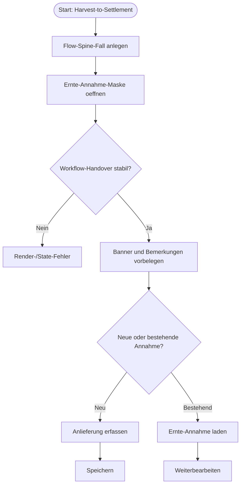

# VK-010 - Harvest-to-Settlement Ernte-Annahme Handover

## A. Workflow-Uebersicht

Gepruefter Workflow: Einstieg aus dem Flow Spine `Harvest-to-Settlement` in die Spezialmaske [`ernte-annahme-erfassung.tsx`](c:/Users/Jochen/VALEO-NeuroERP-3.0/packages/frontend-web/src/pages/agrar/ernte-annahme-erfassung.tsx).

Ziel ist ein belastbarer erster Landhandel-Kernprozess-Slice fuer die Ernte-Annahme. Anders als bei P2P ist hier eine Spezialmaske fachlich gerechtfertigt, weil Wiegeschein, Laborwerte, VAT-/Pricing-Modi, Kontraktbezug und Settlement-nahe Felder in einer kompakten Spezialoberflaeche zusammenlaufen.

Entscheidung `Standardmaske vor Spezialmaske`:

- Fuer Ernte-Annahme ist die vorhandene Spezialmaske gerechtfertigt.
- Kein Rueckbau auf eine generische Standardmaske.
- Der Slice haertet deshalb den Einstieg, Handover und die erste QA-Schicht dieser Spezialmaske.

## B. Vollstaendige Card-Liste

1. `VK-010` Harvest-to-Settlement-Vorgang anlegen
   Flow Spine erzeugt Prozesskontext und verlinkt in die Annahmemaske.
2. `VK-020` Ernte-Annahme-Maske mit Handover oeffnen
   Banner, Vorgangsbezug und operative Notizen muessen stabil uebernommen werden.
3. `VK-030` Annahme erfassen oder bestehende Annahme laden
   Neue Annahme anlegen oder bestehende Annahme per ID laden.
4. `VK-040` Browser-Use fuer Handover und Erfassung pruefen
   Einstieg, Bemerkungen, Speichern und Ruecksprung muessen manuell nachvollziehbar sein.

Detail-Card:

- [`docs/cards/agrar/VK-010-ernte-annahme-standardmaske.md`](c:/Users/Jochen/VALEO-NeuroERP-3.0/docs/cards/agrar/VK-010-ernte-annahme-standardmaske.md)

## C. Mermaid-Diagramm

## D. Soll-Ist-Abweichungen

| Card | Soll | Ist | Abweichung | Risiko | Massnahme |
|------|------|-----|------------|--------|-----------|
| `VK-020` | Harvest-Handover darf die Ernte-Annahme-Maske stabil vorbelegen. | Vor diesem Slice wurde `readWorkflowEntryContext(searchParams)` pro Render neu aufgebaut. | Gleicher Render-Loop-Risikopfad wie bereits in P2P-001. | hoch | Workflow-Kontext memoizen und Seitentest fuer Handover nachziehen. |
| `VK-020` | Nutzer muessen Workflow-Bezug in der Maske wiederfinden. | Banner und Bemerkungsvorbelegung waren vorhanden, aber nicht testlich abgesichert. | QA-Luecke bei einem kritischen Landhandel-Einstieg. | mittel | Page-Test plus Browser-Use-Checkliste ergaenzen. |
| `VK-040` | Browser-Use fuer den Handover-Pfad muss restart-sicher dokumentiert sein. | Bisher nur generische QA-Fragen vorhanden. | Manuelle Pruefung war nicht reproduzierbar beschrieben. | mittel | Harvest-spezifische Checkliste fortschreiben. |

## E. UI-/CRUD-Befunde

- `Create`: vorhanden ueber `POST /api/v1/agrar/harvest-acceptance`.
- `Read / Suchen`: vorhandenes Laden ueber `GET /api/v1/agrar/harvest-acceptance/{id}`.
- `Update`: vorhandene Bearbeitung ueber `PUT`.
- `Delete`: nur fuer `draft`.
- `Statuswechsel`: Release/Freigabe vorhanden.
- `Maskenuebergabe`: Flow-Spine-Handover schreibt Banner und Bemerkungen.
- `Sackgasse`: Vor diesem Slice bestand Render-Loop-Risiko durch nicht memoisierten Handover-Kontext.
- `Browser-Use`: Einstieg ueber Flow Spine, Banner, Bemerkungen und Speichern sind pruefbar.

## F. Risiken

- `mittel`: Die Harvest-Maske ist gross und fachlich dicht; weitere Pflichtfeld- oder Inline-Validierungen sind noch nicht in diesem Slice bewertet.
- `mittel`: `useAuth()`-abhaengige Bediener-Vorbelegung muss stabil bleiben; instabile Session-Objekte koennen unnötige Re-Renders ausloesen.
- `niedrig`: React-Router-Zukunftswarnungen bestehen in den Tests, sind aber nicht Teil des Slices.

## G. Konkrete Empfehlungen

1. Harvest-Handover mit memoisiertem Kontext als festen Pattern-Standard fuer weitere Spezialmasken behandeln.
2. Browser-Use-Checkliste fuer Ernte-Annahme beim naechsten Slice um Wiegeschein-, Kontrakt- und Freigabepfad erweitern.
3. Im Folgeslice Pflichtfeld- und Speichervalidierung fuer den eigentlichen Annahmebeleg vertiefen.
4. Kontrakt-, Wiegeschein- und Qualitaetsbezug als naechste Mikroprozesse separat in Cards zerlegen.

## Annahmen

- Die Spezialmaske ist fuer Ernte-Annahme fachlich gerechtfertigt und wird nicht durch eine generische Standardmaske ersetzt.
- Der erste belastbare Slice fokussiert den Handover und nicht die Vollabnahme aller Pricing-/Settlement-Regeln.
- Workflow-Bemerkungen duerfen additive operative Hinweise sein und muessen bestehende Fachbemerkungen nicht ueberschreiben.

## Status

**Erstanalyse abgeschlossen** — Harvest-to-Settlement Flow-Spine aktiv, Spezialmaske fuer Ernte-Annahme dokumentiert.
