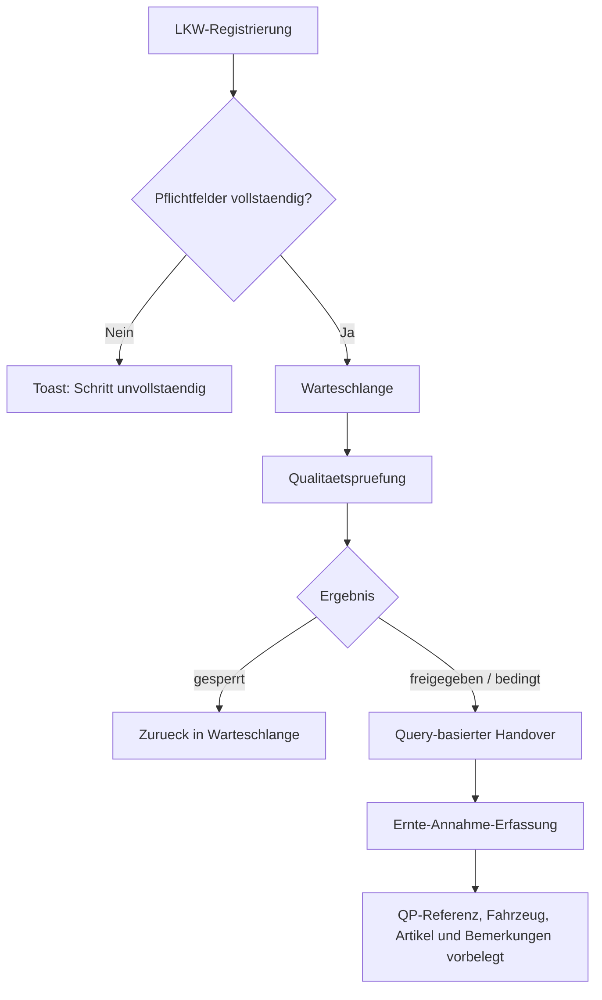

# VK-011 - Qualitaets-Check Handover und LKW-Wizard-Schrittvalidierung

## A. Workflow-Uebersicht

Gepruefter Workflow: Annahme-Kette vom Touch-Wizard `LKW-Registrierung` ueber `Qualitaetspruefung` bis in die Spezialmaske `Ernte-Annahme-Erfassung`.

Ziel dieses Slices ist der restart-sichere Handover aus der Qualitaetspruefung in die Ernte-Annahme sowie die additive Schrittvalidierung im LKW-Wizard.

Entscheidung `Standardmaske vor Spezialmaske`:

- Fuer die LKW-Registrierung bleibt der generische Wizard korrekt.
- Fuer die Ernte-Annahme bleibt die Spezialmaske fachlich gerechtfertigt.
- Der Slice verbindet beide sauber, statt eine neue Zwischenmaske einzufuehren.

## B. Vollstaendige Card-Liste

11. `VK-011` Qualitaets-Check -> Ernte-Annahme-Handover und LKW-Wizard-Haertung
    Query-basierter Handover, QP-Referenz, Pflichtvalidierung fuer Touch-Wizard.

Detail-Card:

- [`docs/cards/agrar/VK-011-qp-handover-und-lkw-validierung.md`](c:/Users/Jochen/VALEO-NeuroERP-3.0/docs/cards/agrar/VK-011-qp-handover-und-lkw-validierung.md)

## C. Mermaid-Diagramm

## D. Soll-Ist-Abweichungen

| Card | Soll | Ist | Abweichung | Risiko | Massnahme |
|------|------|-----|------------|--------|-----------|
| `VK-011` | Qualitaetspruefung muss ohne Medienbruch in die Ernte-Annahme weiterleiten. | Vor diesem Slice ging der Erfolgspfad zur Warteschlange zurueck. | Medienbruch nach QP; Vorbelegung musste manuell wiederholt werden. | hoch | Query-basierten Handover mit `qualityProtocolId`, Fahrzeug, Artikel und Bemerkungen einfuehren. |
| `VK-011` | Ernte-Annahme muss QP-Referenz restart-sicher behalten. | Vor diesem Slice wurden weder Query- noch State-Vorbelegung konsumiert. | Refresh oder Wiederoeffnen verlor den Handover-Kontext. | hoch | Query-Parameter auswerten, Bemerkungen additiv vorbelegen und `quality_protocol_id` mitpersistieren. |
| `VK-011` | LKW-Wizard darf leere Pflichtschritte nicht weiterlassen. | Vor diesem Slice konnte `Weiter` ohne Kennzeichen, Lieferant oder Artikel geklickt werden. | Leere oder unbrauchbare Queue-Eintraege. | hoch | `getStepValidationError` und destructive Toasts im Wizard verdrahten. |

## E. UI-/CRUD-Befunde

- `Create`: vorhanden in LKW-Registrierung, Qualitaetspruefung und Ernte-Annahme.
- `Read / Suchen`: Warteschlange und bestehende Ernte-Annahmen vorhanden.
- `Update`: Ernte-Annahme und Qualitaetsdaten bleiben editierbar.
- `Delete`: nicht Teil dieses Slices.
- `Maskenuebergabe`: jetzt ueber Query-Parameter statt nur impliziter Navigation.
- `Browser-Use`: Touch-Wizard, QP-Abschluss und Ernte-Annahme-Vorbelegung sind direkt pruefbar.

## F. API-Contracts

### Qualitaetsprotokoll `POST /api/v1/agrar/quality-protocols`

Genutzte Rueckgabe:
- `id` -> `qualityProtocolId`
- `reference_context` -> bleibt zusaetzliche Prozessreferenz

### Ernte-Annahme `POST /api/v1/agrar/harvest-acceptance`

Neu mitpersistiert:
- `quality_protocol_id`
- `vehicle_plate`
- `remarks`

## G. Risiken

- `mittel`: Artikelname wird fuer den Handover aktuell aus dem QP-/Queue-Kontext als Freitext uebergeben; die kanonische Artikel-API bleibt ein Folgethema.
- `mittel`: Der Queue-Pfad selbst hat noch keinen expliziten `Ernte-Annahme anlegen`-Button; dieser Slice haertet den QP-Pfad.
- `niedrig`: `tsc --noEmit` lief in dieser Session mehrfach ins Timeout, ohne einen konkreten TypeScript-Fehler zu liefern.

## H. Konkrete Empfehlungen

1. VK-013 als naechsten offenen Landhandel-Slice claimen oder einen separaten VK-Folgeslice fuer Artikel-API/Queue-CTA schneiden.
2. Browser-Use fuer `bedingt` gesondert pruefen, falls fachlich ein anderer Freigabepfad benoetigt wird.
3. QP- und Ernte-Annahme-Referenzen spaeter auch in der Warteschlange sichtbar machen.

## Annahmen

- `quality_protocol_id` ist ein gueltiger Frontend-Write-Contract der Ernte-Annahme-API.
- Der restart-sichere Mindestpfad wird ueber Query-Parameter erreicht; Route-State allein ist nicht ausreichend.
- `bedingt` darf aktuell wie `freigegeben` in die Ernte-Annahme weiterlaufen.

## Status

**Erstanalyse abgeschlossen** — QP-Handover und LKW-Validierung dokumentiert.
