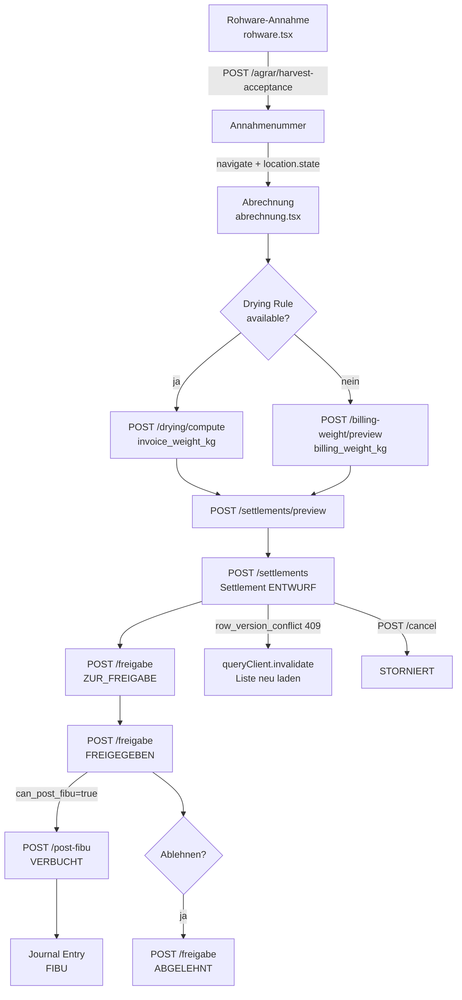

# VK-012 — Annahme-Abrechnung: Settlement-Flow-Analyse

**Slice:** VK-012 | **Status:** abgeschlossen | **Owner:** Claude Sonnet 4.6
**Betroffene Dateien:** `annahme/abrechnung.tsx`, `annahme/rohware.tsx`
**Datum:** 2026-03-27

---

## A — Übersicht

Der Abrechnungsflow schließt die Ernte-Annahmekette ab. Nach Qualitäts-Check und Einlagerung wird ein Settlement (Selbst-Abrechnungsbeleg) erstellt, der alle Abzüge (Trocknung, Reinigung, Fracht) ausweist und anschließend den Freigabe-Workflow bis zur FIBU-Verbuchung durchläuft.

### Kernprozesse

| Prozessschritt | Maske / Endpoint |
|---|---|
| Rohware-Annahme (schnelle Erfassung) | `annahme/rohware.tsx` → `POST /api/v1/agrar/harvest-acceptance` |
| Settlement anlegen | `annahme/abrechnung.tsx` → `POST /api/v1/agrar/settlements` |
| Abrechnungsgewicht vorberechnen | `POST /api/v1/agrar/settlements/billing-weight/preview` |
| Trocknungsregel berechnen | `POST /api/v1/agrar/settlements/drying/compute` |
| Settlement-Preview | `POST /api/v1/agrar/settlements/preview` |
| Freigabe-Workflow | `POST /api/v1/agrar/settlements/{id}/freigabe` |
| FIBU-Verbuchung | `POST /api/v1/agrar/settlements/{id}/post-fibu` |
| Storno | `POST /api/v1/agrar/settlements/{id}/cancel` |

---

## B — Karten-Übersicht

### Karte 1: Rohware-Annahme (rohware.tsx)
- **Zweck:** Touch-optimierter Schnellerfassungs-Wizard für Rohware ohne Vollanalyse
- **Schritte:** Lieferant & Fahrzeug → Ware & Gewicht → Qualitätswerte (optional) → Übersicht
- **Besonderheit:** Qualitätswerte sind optional; STORAGE_ONLY Modus
- **Weiterleitung:** "Zur Abrechnung" → `abrechnung.tsx` mit `location.state` (artikel, feuchtigkeit, verunreinigung)

### Karte 2: Settlement-Anlage (abrechnung.tsx)
- **Zweck:** Vollständiger Abrechnungsflow mit Abzugsberechnung
- **Prefill:** `location.state.fromQualitaetsCheck` → Übernahme von artikel/feuchtigkeit/verunreinigung
- **Abzugslogik:** Trocknung (>14% Feuchte), Reinigung (>2% Verunreinigung), Fracht (fix)
- **Drying Rule Engine:** `toCropCode()` → crop_code → `/drying/compute` → invoice_weight_kg

### Karte 3: Freigabe-Workflow
- **Statusfolge:** ENTWURF → ZUR_FREIGABE → TEILWEISE_FREIGEGEBEN → FREIGEGEBEN → VERBUCHT
- **Optimistic Locking:** `row_version` bei allen schreibenden Operationen (conflict → 409 mit `code: row_version_conflict`)
- **Correction Options:** credit / debit / rework memo → `openCorrection()` → `/einkauf/gutschriften-belastungen`

### Karte 4: FIBU-Verbuchung
- **Accounts:** Debit 5000 (Wareneingang), Credit 3300 (Lieferant), Credit 5490 (Abzüge)
- **Guard:** `can_post_fibu` Flag vom Backend; nur bei FREIGEGEBEN aktiv
- **Idempotenz:** `expected_row_version` verhindert Doppelverbuchung

---

## C — Prozessfluss (Mermaid)

---

## D — Soll-Ist-Abweichungen

| # | Soll | Ist | Bewertung |
|---|---|---|---|
| D-01 | Rohware-Annahme POST auf `/api/v1/agrar/harvest-acceptance` | War `/api/v1/harvest-acceptance` (404) | **Behoben** in diesem Slice |
| D-02 | Qualitätswerte aus Rohware-Annahme werden in Settlement prefilled | `location.state` korrekt übergeben und in `useEffect` ausgelesen | OK |
| D-03 | Drying Rule Engine als primärer Kalkulationspfad | Implementiert mit Fallback auf billing-weight/preview | OK |
| D-04 | Optimistic Locking bei allen schreibenden Operationen | `row_version` + 409-Handling in allen 3 Mutations | OK |
| D-05 | Step-Validierung im Rohware-Wizard | Kein `getStepValidationError` — Lieferant/Kennzeichen/Artikel/Lager required-Felder ohne Wizard-Guard | Offener Punkt (VK-012-P1) |
| D-06 | Hardcoded ARTIKEL_OPTIONEN / LAGER_OPTIONEN | Liste im Code, kein API-Lookup | Akzeptiert für v1 |
| D-07 | Supplier-ID Pflichtfeld ohne Dropdown | Freitext-Input für `supplierId` — kein CRM-Lookup | Offener Punkt (VK-012-P2) |

---

## E — UI/CRUD-Status

### rohware.tsx
| Funktion | Status |
|---|---|
| POST /agrar/harvest-acceptance | Behoben (war falscher Pfad) |
| 4-Schritte Wizard | OK |
| Touch-optimierte Eingabe | OK |
| Weiterleitung zu abrechnung.tsx mit Qualitätsdaten | OK |
| Schritt-Validierung (getStepValidationError) | Fehlt |

### abrechnung.tsx
| Funktion | Status |
|---|---|
| location.state Prefill | OK |
| Drying Rule Engine (toCropCode + /drying/compute) | OK |
| Billing Weight Preview | OK |
| Settlement Preview | OK |
| Settlement CREATE | OK |
| Freigabe-Workflow | OK |
| Optimistic Locking + 409 Handling | OK |
| FIBU Post | OK |
| Storno | OK |
| Korrektur-Belege (credit/debit) | OK (Weiterleitung) |
| Supplier-ID CRM-Dropdown | Fehlt (VK-012-P2) |

---

## F — Risiken

| Risiko | Schwere | Maßnahme |
|---|---|---|
| Rohware-POST an falsche URL → 404 | Hoch | Behoben in diesem Slice |
| Supplier-ID als Freitext → keine Validierung gegen CRM | Mittel | Für VK-012-P2 vorgemerkt |
| Kein Wizard-Step-Guard → ungültige Daten können durchkommen | Mittel | Für VK-012-P1 vorgemerkt |
| Hardcoded Artikel-/Lagerlisten → Pflegeaufwand | Niedrig | API-Lookup als Folge-Story |
| `useEffect` auf `location.state` — keine Cleanup bei Back-Navigation | Niedrig | React Router state bleibt erhalten; kein Re-Trigger |

---

## G — Empfehlungen

1. **VK-012-P1 (nächste Session):** `getStepValidationError` in rohware.tsx Wizard eintragen — Schritt 1 guards: lieferant + kennzeichen, Schritt 2 guards: artikel + bruttoKg>0 + lagerZiel
2. **VK-012-P2:** Supplier-ID Freitext durch CRM-Dropdown ersetzen (`useCustomers()` Hook)
3. **VK-012-P3:** ARTIKEL_OPTIONEN und LAGER_OPTIONEN aus API laden (`/api/v1/articles?is_grain=true`, `/api/v1/lager/silos`)
4. **VK-013:** Ernte-Kampagne-Abschluss — Gesamtabrechnung über alle Settlements einer Kampagne
