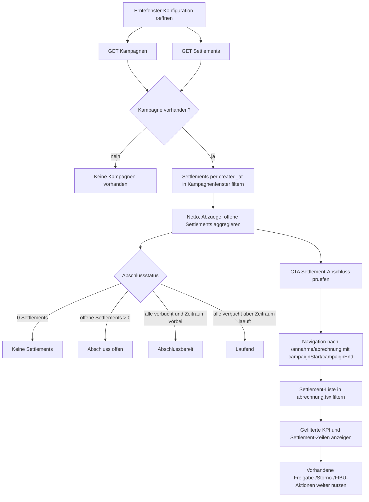

# VK-013 - Ernte-Kampagnenabschluss

**Slice:** VK-013 | **Status:** abgeschlossen | **Owner:** aktuell offener Agent (Codex)
**Datum:** 2026-03-27

## A - Workflow-Uebersicht

`VK-013` schliesst eine Erntekampagne nicht ueber eine neue Spezialmaske, sondern ueber zwei bestehende Standardmasken:

- [`packages/frontend-web/src/pages/agrar/erntefenster-konfig.tsx`](c:/Users/Jochen/VALEO-NeuroERP-3.0/packages/frontend-web/src/pages/agrar/erntefenster-konfig.tsx) als Kampagnenkontext und Aggregations-Einstieg
- [`packages/frontend-web/src/pages/annahme/abrechnung.tsx`](c:/Users/Jochen/VALEO-NeuroERP-3.0/packages/frontend-web/src/pages/annahme/abrechnung.tsx) als fachlicher Pruef- und Abschlussort fuer die zugehoerigen Settlements

Die implementierte Loesung aggregiert vorhandene Settlements je Kampagne ueber `created_at` innerhalb des Kampagnenfensters (`start_date` bis `end_date`) und verlinkt von der Kampagnenliste in eine gefilterte Abrechnungsansicht. Damit ist erstmals ein belastbarer Kampagnenabschluss-Pfad in der UI verfuegbar, ohne einen parallelen Spezialprozess einzufuehren.

## B - Vollstaendige Card-Liste

1. `VK-013-C1` Kampagne in der Erntefenster-Konfiguration lesen und Abschlussstatus aus vorhandenen Settlements berechnen
2. `VK-013-C2` Aggregierte KPI je Kampagne anzeigen: Anzahl Settlements, Netto gesamt, Abzuege gesamt, offene Settlements
3. `VK-013-C3` Aus der Kampagne in die gefilterte Settlement-Pruefung abspringen
4. `VK-013-C4` Abrechnungsseite ueber Query-Parameter auf Kampagnenfenster filtern
5. `VK-013-C5` Gefilterte Settlement-Liste im bestehenden Freigabe-/Pruefkontext lesen
6. `VK-013-C6` Abschlussreife bewerten: keine Settlements, offen, abschlussbereit, laufend

## C - Mermaid-Diagramm

## D - Soll-Ist-Abweichungen

| ID | Soll | Ist nach VK-013 | Bewertung |
|---|---|---|---|
| D-01 | Kampagnenabschluss soll aus bestehender Kampagnenliste erreichbar sein | CTA `Settlement-Abschluss pruefen` in `erntefenster-konfig.tsx` vorhanden | behoben |
| D-02 | Kampagnenabschluss soll Gesamtsummen und Restoffenheit je Kampagne sichtbar machen | KPI-Boxen und Abschlussstatus pro Kampagne vorhanden | behoben |
| D-03 | Abschlusspruefung soll in bestehender Abrechnungsmaske stattfinden | Query-basierte Filterung in `abrechnung.tsx` vorhanden | behoben |
| D-04 | Kampagne und Settlement sollten fachlich ueber explizite Referenz verknuepft sein | Filter basiert vorerst nur auf `created_at` im Zeitfenster | bewusst begrenzte Zwischenloesung |
| D-05 | Backend sollte idealerweise kampagnenbezogene Summen serverseitig liefern | Aggregation erfolgt aktuell rein im Frontend | offen |

## E - UI-/CRUD-Befunde

### `erntefenster-konfig.tsx`

- Read: Kampagnen und Templates koennen gelesen werden.
- Update: keine direkte Bearbeitung im Slice, aber Kampagnenstatus wird lesbar verdichtet.
- Zusatznutzen: bestehende Kampagnenliste zeigt jetzt Abschlussreife statt nur Metadaten.
- CTA: `Settlement-Abschluss pruefen` oeffnet den fachlich passenden Folgeprozess.

### `abrechnung.tsx`

- Read: Settlement-Liste wird bei vorhandenem Kampagnenkontext sauber gefiltert.
- Read/KPI: Kampagnenfenster, Anzahl und offener/Netto-Wert werden oberhalb der Liste angezeigt.
- Update/Folgeaktionen: vorhandene Freigabe-, FIBU- und Stornoaktionen bleiben auf den gefilterten Datensaetzen verfuegbar.
- Delete: weiterhin fachlich nur ueber Storno.

## F - Risiken

### kritisch

- keine

### hoch

- Keine explizite Kampagnenreferenz am Settlement-Contract. Zwei Kampagnen mit ueberlappenden Zeitfenstern koennten dieselben Settlements einschliessen.

### mittel

- `created_at` ist nur ein technischer Proxy fuer die fachliche Zuordnung. Nachtraeglich erfasste oder korrigierte Settlements koennen im falschen Fenster landen.
- Aggregation liegt im Frontend; bei grossen Settlement-Mengen fehlt serverseitige Pagination/Optimierung fuer den Kampagnenabschluss.

### niedrig

- Abschlussstatus `Laufend`/`Abschlussbereit` ist rein UI-seitig und wird noch nicht als eigener Backend-Status persistiert.

## G - Konkrete Empfehlungen

1. Backend-Folgeslice: kampagnenbezogene Referenz oder dedizierten Abschluss-Endpoint fuer Settlements einfuehren.
2. Folge-Slice fuer Landhandel: Queue-/Abschluss-CTA aus Warteschlange oder Kampagnenmonitor um einen expliziten Abschlussprozess erweitern.
3. Wenn Kampagnen ueberlappen duerfen, Frontend-Filter von `created_at` auf echte Kampagnen-ID umstellen.
4. Browser-Use fuer Monatswechsel, leere Kampagne und offene Draft-Settlements regelmaessig gegen die QA-Checkliste fahren.

## Annahmen

- Settlements besitzen derzeit keine belastbare Kampagnen-ID; `created_at` im Kampagnenfenster ist deshalb der einzig verfuegbare restart-sichere Filter.
- Der fachlich richtige Abschlussort bleibt die bestehende Abrechnungsmaske; eine neue Spezialmaske waere fuer diesen Slice Overengineering.
- Kampagnen in `erntefenster-konfig.tsx` sind der kanonische Einstieg fuer saisonale Abschlusspruefungen.
