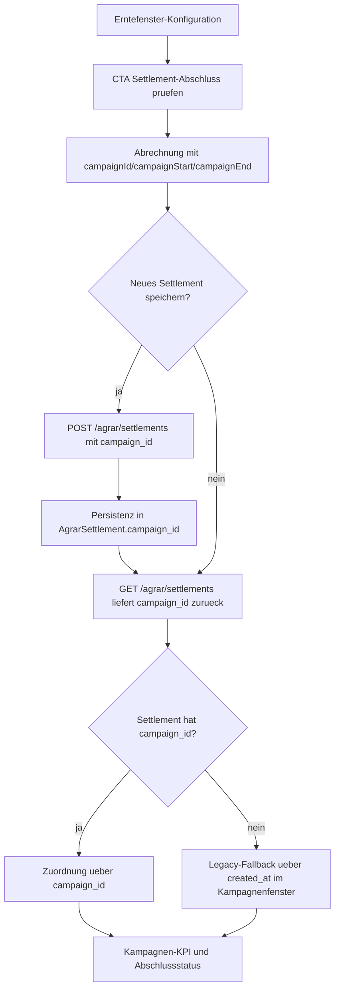

# VK-014 - Settlement-Kampagnenreferenz

**Slice:** VK-014 | **Status:** abgeschlossen | **Owner:** aktuell offener Agent (Codex)
**Datum:** 2026-03-27

## A - Workflow-Uebersicht

`VK-014` ersetzt den unscharfen Zeitfenster-Proxy aus `VK-013` durch eine echte fachliche Kampagnenreferenz am Settlement-Contract. Settlements koennen damit einer Erntefenster-Kampagne explizit zugeordnet, gespeichert, gelesen und im Kampagnenabschluss bevorzugt ueber `campaign_id` statt ueber `created_at` gefiltert werden.

Die Loesung bleibt restart-sicher und standardmaskenbasiert:

- [`packages/frontend-web/src/pages/agrar/erntefenster-konfig.tsx`](c:/Users/Jochen/VALEO-NeuroERP-3.0/packages/frontend-web/src/pages/agrar/erntefenster-konfig.tsx) aggregiert Kampagnen bevorzugt ueber `campaign_id`
- [`packages/frontend-web/src/pages/annahme/abrechnung.tsx`](c:/Users/Jochen/VALEO-NeuroERP-3.0/packages/frontend-web/src/pages/annahme/abrechnung.tsx) persistiert `campaign_id` beim Speichern und filtert Listen kampagnenbezogen
- [`app/api/v1/endpoints/agrar_settlements.py`](c:/Users/Jochen/VALEO-NeuroERP-3.0/app/api/v1/endpoints/agrar_settlements.py) und [`l3c_models.py`](c:/Users/Jochen/VALEO-NeuroERP-3.0/app/infrastructure/models/l3c_models.py) fuehren die Referenz im Backend ein

## B - Vollstaendige Card-Liste

1. `VK-014-C1` Kampagnen-ID im Settlement-Write-Contract entgegennehmen
2. `VK-014-C2` Kampagnen-ID am Settlement persistieren
3. `VK-014-C3` Kampagnen-ID im Settlement-Read-Contract ausgeben
4. `VK-014-C4` Kampagnenabschluss im Frontend bevorzugt ueber `campaign_id` berechnen
5. `VK-014-C5` Legacy-Settlements ohne Referenz weiter ueber Datumsfenster einbeziehen
6. `VK-014-C6` Settlement-Anlage aus Kampagnenkontext mit `campaign_id` speichern

## C - Mermaid-Diagramm

## D - Soll-Ist-Abweichungen

| ID | Soll | Ist nach VK-014 | Bewertung |
|---|---|---|---|
| D-01 | Settlement muss einer Kampagne explizit zugeordnet werden koennen | `campaign_id` im Modell, API-Write- und Read-Contract vorhanden | behoben |
| D-02 | Kampagnenabschluss soll nicht mehr nur auf `created_at` beruhen | Frontend nutzt `campaign_id` bevorzugt und faellt nur fuer Alt-Daten zurueck | behoben |
| D-03 | Bestehende Alt-Daten duerfen nicht sofort unsichtbar werden | Legacy-Fallback ueber Datumsfenster bleibt erhalten | behoben |
| D-04 | Datenbankschema muss bestehende Deployments nachziehen | Alembic-Migration fuer `campaign_id` und Index vorhanden | behoben |
| D-05 | Backend sollte Kampagnenfilter direkt unterstuetzen | `GET /agrar/settlements` akzeptiert jetzt `campaign_id` | behoben |

## E - UI-/CRUD-Befunde

### Create

- `abrechnung.tsx` uebergibt `campaign_id` beim Settlement-Speichern, wenn die Maske aus dem Kampagnenkontext geoeffnet wurde.

### Read

- `erntefenster-konfig.tsx` und `abrechnung.tsx` nutzen kampagnenbezogene Zuordnung bevorzugt ueber `campaign_id`.
- Legacy-Read bleibt moeglich, wenn alte Settlements noch keine Referenz tragen.

### Update / Folgeaktionen

- Freigabe, FIBU-Buchung und Storno bleiben unveraendert auf Settlement-Ebene nutzbar.
- Die Kampagnenreferenz ist in diesem Slice write-on-create; keine separate UI fuer nachtraegliche Umpraegung.

## F - Risiken

### kritisch

- keine

### hoch

- Bestehende Alt-Settlements ohne `campaign_id` bleiben weiterhin vom Datumsfenster-Fallback abhaengig, bis sie migriert oder neu erzeugt werden.

### mittel

- Tenant-Settings bleiben die Quelle fuer Erntefenster-Kampagnen; es gibt weiterhin keine relationale Kampagnentabelle im Kernschema.

### niedrig

- Frontend liest derzeit weiterhin die Settlement-Liste breit und filtert lokal; das ist fachlich korrekt, aber nicht die effizienteste API-Nutzung.

## G - Konkrete Empfehlungen

1. Folge-Slice fuer Backfill oder Repair-Tooling: Alt-Settlements nachtraeglich ueber Kampagnen-ID anreichern.
2. Optionaler API-Folgeschritt: `campaign_id` in den Frontend-Reads auch serverseitig aktiv nutzen, um Datenmenge zu reduzieren.
3. Danach erst Queue-/Artikel-API als separaten Agrar-Folgeslice ziehen, weil die kampagnenfachliche Zuordnung jetzt die belastbarere Prioritaet hatte.

## Annahmen

- Erntefenster-Kampagnen bleiben vorerst in Tenant-Settings gespeichert; eine String-Referenz `campaign_id` ist daher der pragmatisch richtige Vertrag.
- Alt-Daten ohne Referenz muessen sichtbar bleiben; deshalb ist der Datumsfenster-Fallback weiterhin gewollt.
- Eine nachtraegliche Edit-Maske fuer `campaign_id` ist fuer diesen Slice nicht erforderlich.

## Status

**Erstanalyse abgeschlossen** — Settlement-Kampagnenreferenz dokumentiert.
