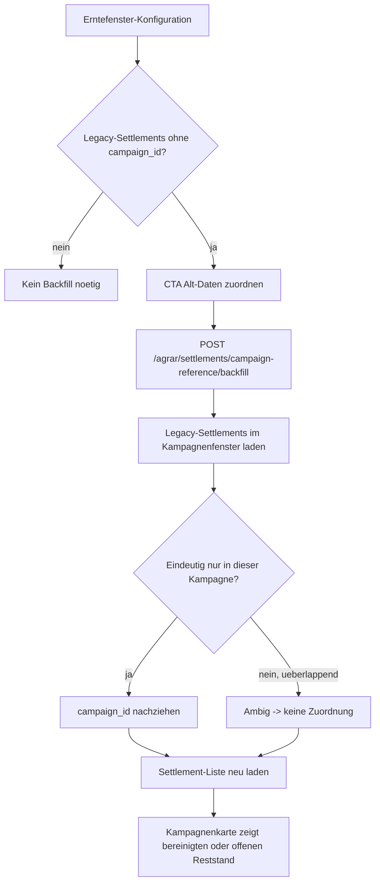

# VK-015 - Settlement-Kampagnen-Backfill

**Slice:** VK-015 | **Status:** abgeschlossen | **Owner:** aktuell offener Agent (Codex)
**Datum:** 2026-03-27

## A - Workflow-Uebersicht

`VK-015` schliesst die Restluecke aus `VK-014`: historische Settlements ohne `campaign_id` koennen jetzt kampagnenbezogen ueber die bestehende `Erntefenster-Konfiguration` nachgezogen werden. Der Slice bleibt standardmaskenbasiert und fuehrt keinen freien Masseneditor ein.

Die Repair-Logik ist bewusst konservativ:

- nur Settlements ohne `campaign_id`
- nur im Fenster der ausgewaehlten Kampagne
- keine Zuordnung bei ueberlappenden Kampagnenfenstern
- kein Ueberschreiben bestehender Referenzen

## B - Vollstaendige Card-Liste

1. `VK-015-C1` Legacy-Settlements ohne `campaign_id` im Kampagnenfenster sichtbar markieren
2. `VK-015-C2` kampagnenbezogenen Repair-CTA auf der Standard-Kampagnenkarte anbieten
3. `VK-015-C3` Backend-Repair-Endpoint mit Tenant-Kampagnenkontext bereitstellen
4. `VK-015-C4` nur eindeutige Legacy-Datensaetze auf `campaign_id` nachziehen
5. `VK-015-C5` ueberlappende oder unklare Faelle als ambig markieren und offen lassen
6. `VK-015-C6` UI-, API- und QA-Doku auf den Repair-Pfad nachziehen

## C - Mermaid-Diagramm

## D - Soll-Ist-Abweichungen

| ID | Soll | Ist nach VK-015 | Bewertung |
|---|---|---|---|
| D-01 | Alt-Settlements muessen nach `VK-014` kontrolliert bereinigt werden koennen | Kampagnenkarte bietet Repair-CTA | behoben |
| D-02 | Repair darf keine bestehenden Referenzen ueberschreiben | Endpoint bearbeitet nur `campaign_id IS NULL` | behoben |
| D-03 | Ueberlappende Kampagnen duerfen nicht blind migriert werden | Ambige Faelle bleiben explizit offen | behoben |
| D-04 | Anwender braucht Rueckmeldung ueber Ergebnis des Repairs | Toast zeigt `updated_count` oder Ambiguitaet | behoben |

## E - UI-/CRUD-Befunde

### Read

- Die Kampagnenkarte zeigt jetzt, wenn Legacy-Datensaetze noch ueber den Datumsfenster-Fallback laufen.

### Update

- `Alt-Daten zuordnen` fuehrt einen gezielten Repair auf derselben Standardmaske aus.
- Es gibt bewusst keinen freien Editor fuer `campaign_id`; der Slice bleibt auf sichere Repair-Faelle beschraenkt.

### Grenzen

- Bei ueberlappenden Kampagnenfenstern bleibt der Datensatz offen und muss spaeter fachlich geklaert werden.

## F - Risiken

### kritisch

- keine

### hoch

- Ueberlappende Kampagnenfenster bleiben ohne weitere Fachinformation bewusst unaufgeloest.

### mittel

- Der Repair-CTA arbeitet kampagnenweise; es gibt noch keinen tenantweiten Sammel-Report fuer Ambiguitaeten.

### niedrig

- Frontend invalidiert weiterhin die breite Settlement-Liste statt serverseitig nur die betroffene Kampagne zu refreshen.

## G - Konkrete Empfehlungen

1. Folge-Slice fuer Queue-/Artikel-API in der Annahmekette ziehen, da die Kampagnenzuordnung jetzt fuer Neu- und Alt-Daten belastbar ist.
2. Optional spaeter einen Audit-Report fuer ambige Legacy-Settlements ergaenzen.
3. Ueberlappende Kampagnen fachlich vermeiden oder um zusaetzliche Disambiguierungsmerkmale erweitern.

## Annahmen

- `created_at` bleibt fuer den Repair-Fall die einzig verfuegbare Legacy-Zuordnungsbasis.
- Bei Kampagnenueberlappung ist Nicht-Zuordnen fachlich sicherer als heuristisches Migrieren.
- Ein kampagnenbezogener CTA auf der Standardkarte reicht fuer den operativen Scope; keine Spezialmaske noetig.

## Status

**Erstanalyse abgeschlossen** — Settlement-Kampagnen-Backfill dokumentiert.
