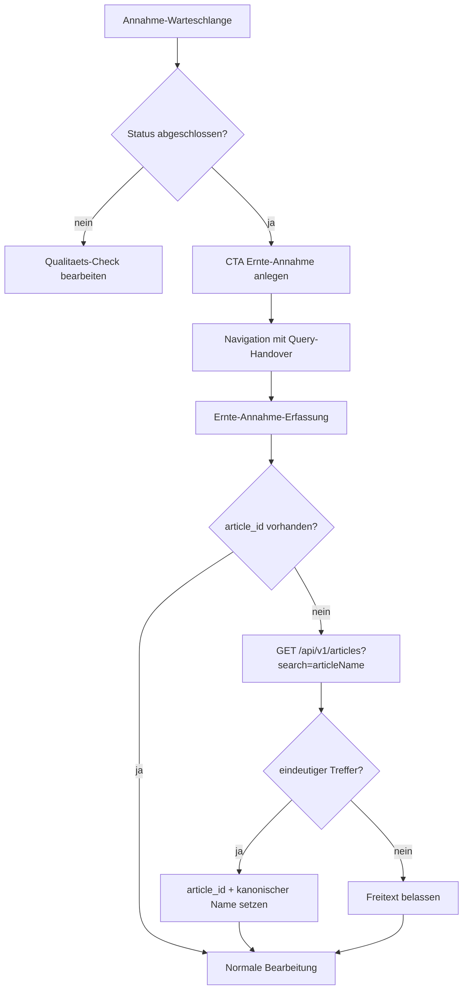

# VK-016 - Queue-CTA und kanonische Artikel-API

**Slice:** VK-016 | **Status:** abgeschlossen | **Owner:** aktuell offener Agent (Codex)
**Datum:** 2026-03-27

## A - Workflow-Uebersicht

`VK-016` schliesst die beiden in `VK-010` und `VK-011` offen gebliebenen Medienbrueche der Annahmekette: abgeschlossene Queue-Eintraege koennen jetzt direkt in die Ernte-Annahme ueberfuehrt werden, und der Handover zieht die kanonische `article_id` ueber die Artikel-API nach statt beim Freitext stehenzubleiben.

Der Slice bleibt auf Standardmasken:

- [`warteschlange.tsx`](c:/Users/Jochen/VALEO-NeuroERP-3.0/packages/frontend-web/src/pages/annahme/warteschlange.tsx) ist der operative Einstieg fuer abgeschlossene Queue-Eintraege
- [`ernte-annahme-erfassung.tsx`](c:/Users/Jochen/VALEO-NeuroERP-3.0/packages/frontend-web/src/pages/agrar/ernte-annahme-erfassung.tsx) bleibt die kanonische Erfassungsmaske

## B - Vollstaendige Card-Liste

1. `VK-016-C1` Queue-Eintrag mit Status `abgeschlossen` sichtbar als Folgeaktion markieren
2. `VK-016-C2` Queue-CTA restart-sicher per Query in die Ernte-Annahme navigieren
3. `VK-016-C3` Queue-Metadaten additiv in die Ernte-Annahme-Bemerkungen uebernehmen
4. `VK-016-C4` `articleName` aus Queue-/QP-Handover ueber `/api/v1/articles` auf kanonische `article_id` aufloesen
5. `VK-016-C5` bei nicht eindeutiger oder fehlerhafter Artikelauflösung den Freitext nicht zerstören

## C - Mermaid-Diagramm

## D - Soll-Ist-Abweichungen

| ID | Soll | Ist nach VK-016 | Bewertung |
|---|---|---|---|
| D-01 | Abgeschlossene Queue-Eintraege muessen direkt in die Ernte-Annahme fuehren koennen | CTA `Ernte-Annahme anlegen` auf der Warteschlange vorhanden | behoben |
| D-02 | Handover muss reload-sicher bleiben | Query-basierter Queue-Handover verwendet | behoben |
| D-03 | Artikel darf nicht nur als Freitext im Ziel landen | Ernte-Annahme versucht kanonische `article_id` ueber Artikel-API nachzuziehen | behoben |
| D-04 | Fehlgeschlagene Artikelauflösung darf den Erfassungspfad nicht blockieren | Freitext bleibt als Fallback erhalten | behoben |

## E - UI-/CRUD-Befunde

### Queue

- `Bearbeiten` bleibt fuer den Qualitaets-Check bestehen.
- Fuer `abgeschlossen` kommt additiv der CTA `Ernte-Annahme anlegen` dazu.

### Ernte-Annahme

- Queue-Handover schreibt `queueEntryId` additiv in die Bemerkungen.
- `article_id` wird still im Hintergrund nachgezogen; der Benutzer bleibt auf der Standardmaske.

## F - Risiken

### kritisch

- keine

### hoch

- keine

### mittel

- Mehrdeutige Artikeltreffer bleiben vorerst beim Freitext und brauchen manuelle Artikelwahl.

### niedrig

- Artikelauflösung sucht aktuell textbasiert; eine spaetere Queue-API mit echter `article_id` waere noch belastbarer.

## G - Konkrete Empfehlungen

1. Naechsten Slice auf Queue-/API-Ebene zuschneiden, damit die Warteschlange selbst eine kanonische `article_id` mitfuehrt.
2. Optional einen visuellen Hinweis in der Ernte-Annahme ergaenzen, wenn nur Freitext und keine aufgeloeste `article_id` vorliegt.
3. Danach erst den gesperrte-Ware-/Klaerungsprozess als eigenen VK-Folgeslice ziehen.

## Annahmen

- `abgeschlossen` in der Warteschlange bedeutet fachlich, dass ein Ernte-Annahme-CTA zulaessig ist.
- Die Artikel-API `/api/v1/articles?search=...` ist aktuell die kanonische Quelle fuer die Auflösung auf `article_id`.
- Bei fehlender Eindeutigkeit ist Freitext-Fallback fachlich sicherer als automatische Fehlzuordnung.
