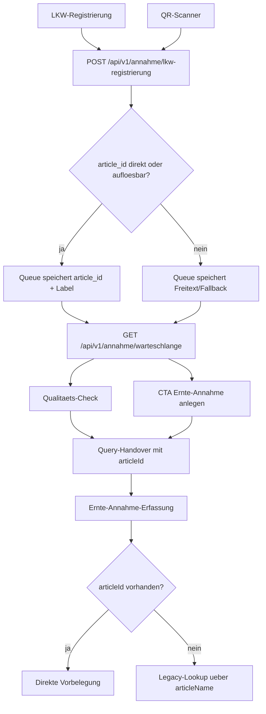

# VK-017 - Queue-Contract mit echter article_id

**Slice:** VK-017 | **Status:** abgeschlossen | **Owner:** Codex
**Datum:** 2026-03-28

## A - Workflow-Uebersicht

`VK-017` hebt den offenen Restbruch aus `VK-016`: die Annahmekette fuehrt die kanonische `article_id` jetzt bereits in der Queue selbst statt erst spaeter per Textsuche in der Ernte-Annahme. Gleichzeitig wird der benachbarte QR-Pfad repariert, weil `qr-scanner.tsx` bislang auf einen nicht vorhandenen POST-Endpoint der Warteschlange zeigte.

Der Slice bleibt auf den bestehenden Standardmasken:

- [`lkw-registrierung.tsx`](c:/Users/Jochen/VALEO-NeuroERP-3.0/packages/frontend-web/src/pages/annahme/lkw-registrierung.tsx) fuer den operativen Eingang
- [`warteschlange.tsx`](c:/Users/Jochen/VALEO-NeuroERP-3.0/packages/frontend-web/src/pages/annahme/warteschlange.tsx) fuer Queue und Folgehandover
- [`qualitaets-check.tsx`](c:/Users/Jochen/VALEO-NeuroERP-3.0/packages/frontend-web/src/pages/annahme/qualitaets-check.tsx) und [`ernte-annahme-erfassung.tsx`](c:/Users/Jochen/VALEO-NeuroERP-3.0/packages/frontend-web/src/pages/agrar/ernte-annahme-erfassung.tsx) fuer den Folgepfad

## B - Vollstaendige Card-Liste

1. `VK-017-C1` Queue-Datenmodell um persistente `article_id` erweitern
2. `VK-017-C2` LKW-Registrierung aus Artikelstammdaten statt aus harter Liste vorbelegen
3. `VK-017-C3` Artikelreferenz bei Queue-Anlage aus `id`, `article_number` oder Name robust aufloesen
4. `VK-017-C4` Queue-, QP- und Harvest-Handover um `articleId` erweitern
5. `VK-017-C5` QR-Pfad auf einen real existierenden POST-Contract zurueckfuehren

## C - Mermaid-Diagramm

## D - Soll-Ist-Abweichungen

| ID | Soll | Ist nach VK-017 | Bewertung |
|---|---|---|---|
| D-01 | Die Queue soll eine echte `article_id` fuehren | `domain_inventory.lkw_annahme_queue.article_id` plus API-Read/Write-Contract vorhanden | behoben |
| D-02 | Operatoren sollen keinen harten Artikelkatalog pflegen | LKW-Registrierung laedt Artikel aus `/api/v1/articles` | behoben |
| D-03 | QR- und Mobile-Pfade muessen denselben Queue-Contract nutzen | QR postet jetzt auf `/api/v1/annahme/lkw-registrierung`; Alias fuer `/annahme/warteschlange` existiert zusaetzlich | behoben |
| D-04 | Die Ernte-Annahme soll `articleId` bevorzugen und Textlookup nur als Fallback nutzen | Query-Handover fuehrt `articleId`; Zielmaske setzt diese direkt | behoben |

## E - UI-/CRUD-Befunde

### LKW-Registrierung

- Artikelauswahl kommt jetzt aus der kanonischen Artikel-API.
- Bei erfolgreicher Auswahl wird `article_id` zusammen mit dem lesbaren Artikelnamen gespeichert.

### Warteschlange / Folgepfad

- Queue-GET liefert jetzt `article_id` additiv aus.
- CTA und QP-Handover transportieren `articleId` restart-sicher bis in die Ernte-Annahme.

### QR-Scanner

- Der bisher kaputte POST auf `/api/v1/annahme/warteschlange` ist technisch abgesichert.
- Primärpfad ist jetzt derselbe Registrierungs-Endpoint wie bei der Standardmaske.

## F - Risiken

### kritisch

- keine

### hoch

- keine

### mittel

- QR-Codes koennen weiterhin Codes liefern, die weder `id` noch `article_number` treffen; dann bleibt nur Freitext.

### niedrig

- Die LKW-Registrierung nutzt bei API-Ausfall weiterhin Fallback-Optionen; die Backend-Aufloesung bleibt dann der zweite Sicherheitsanker.

## G - Konkrete Empfehlungen

1. Klaerungsprozess `gesperrt` ist in VK-018 umgesetzt; naechster Schritt ist die operative Abnahme des Klaerungspfads.
2. Spaeter einen expliziten Queue-Hinweis fuer unaufgeloeste QR-Artikelcodes ergaenzen.
3. Optional vorhandene historische Queue-Eintraege ohne `article_id` per kleinen Repair-Slice nachziehen, falls sie fachlich relevant bleiben.

## Annahmen

- `article_number` ist im QR-Kontext die wahrscheinlichste externe Artikelreferenz neben der echten `article_id`.
- Bei fehlender Aufloesung ist Freitext-Fallback fachlich sicherer als eine falsche Zuordnung.
- Die Artikel-API `/api/v1/articles` bleibt die kanonische Quelle fuer die Standardmaske.

## Status

**Erstanalyse und Umsetzung abgeschlossen** - Queue-Contract fuehrt `article_id`, Handover wurde durchgaengig nachgezogen.
