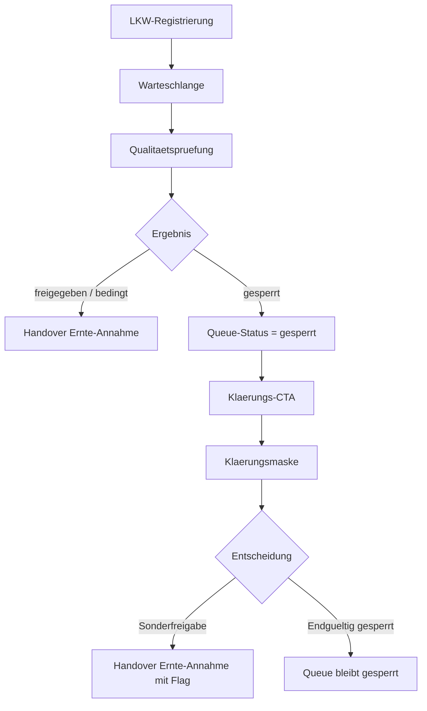

# VK-018 - Klaerungsprozess gesperrte Ware

**Slice:** VK-018 | **Status:** abgeschlossen | **Owner:** Codex  
**Datum:** 2026-03-28

## A - Workflow-Uebersicht

`VK-018` schliesst die offene Luecke aus `VK-010/011/016/017`: Qualitaetspruefungen mit Ergebnis `gesperrt` fallen aktuell in die Warteschlange zurueck, ohne dokumentierten Klaerungsprozess, ohne Statusfuehrung und ohne klaren CTA. Ziel ist ein klarer, restart-sicherer Klaerungspfad, der `gesperrt` sauber dokumentiert und erst nach expliziter Freigabe wieder in die Ernte-Annahme fuehrt.

Entscheidung `Standardmaske vor Spezialmaske`:

- Primaer werden bestehende Standardmasken (Qualitaets-Check + Warteschlange) erweitert.
- Eine dedizierte kleine Klaerungsmaske ist nur zulaessig, wenn kein Standardpfad die Entscheidung dokumentieren kann.
- Der Klaerungspfad darf nie automatisch in die Ernte-Annahme springen.

## B - Vollstaendige Card-Liste

1. `VK-018-C1` Gesperrt-Ergebnis markiert Queue-Eintrag und zeigt Klaerungs-CTA
2. `VK-018-C2` Klaerungsmaske erfasst Entscheidung + Begruendung
3. `VK-018-C3` Sonderfreigabe fuehrt kontrolliert in die Ernte-Annahme
4. `VK-018-C4` Endgueltig gesperrt bleibt dokumentiert in der Queue

## C - Mermaid-Diagramm

## D - Soll-Ist-Abweichungen

| ID | Soll | Ist vor VK-018 | Bewertung |
|---|---|---|---|
| D-01 | `gesperrt` braucht einen dokumentierten Klaerungsprozess | QP springt zur Warteschlange zurueck, ohne CTA/Status | offen |
| D-02 | Entscheide `Sonderfreigabe` oder `endgueltig gesperrt` mit Begruendung | keine Entscheidungsmaske, keine Persistenz | offen |
| D-03 | Queue muss gesperrte Eintraege sichtbar markieren | Status kennt nur wartend/in-bearbeitung/abgeschlossen | offen |

## E - UI-/CRUD-Befunde

### Qualitaets-Check

- `gesperrt` benoetigt eine klare Folgeaktion (Klaerung starten), nicht nur Ruecksprung.

### Warteschlange

- gesperrte Eintraege muessen sichtbar markiert und filterbar sein.
- CTA fuer Klaerung darf nur bei `gesperrt` erscheinen.

### Klaerungsmaske

- Muss Entscheidung + Begruendung speichern (CRUD: Create/Update).
- Muss restart-sicher sein (Eintrag per ID aufrufbar).

## F - Risiken

### kritisch

- keine

### hoch

- Ohne dokumentierte Entscheidung bleibt gesperrte Ware im operativen Schwebezustand.

### mittel

- Sonderfreigaben ohne klare Begruendung fuehren zu Audit-Luecken.

### niedrig

- Zusaetzliche Statuswerte in der Queue erfordern minimale UI-Anpassung.

## G - Konkrete Empfehlungen

1. Queue-Status um `gesperrt` und Klaerungsmetadaten erweitern.
2. Klaerungsmaske minimal halten (Entscheidung, Begruendung, Datum).
3. Sonderfreigabe in die Ernte-Annahme nur mit explizitem Flag/Kommentar fuehren.

## Annahmen

- `gesperrt` darf nicht automatisch in die Ernte-Annahme weiterlaufen.
- Sonderfreigabe ist ein Fachentscheid und braucht Begruendung.
- Eine kleine Klaerungsmaske ist fachlich akzeptabel, wenn Standardmasken die Entscheidung nicht erfassen koennen.

## Status

**Abgeschlossen** — Klaerungspfad, Queue-Status und UI-CTA umgesetzt und dokumentiert.
