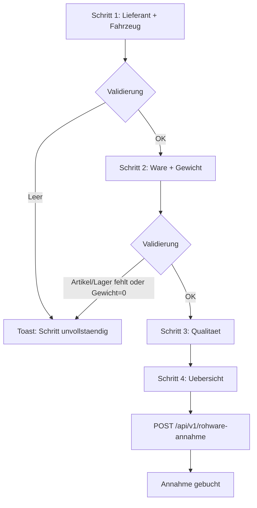

# VK-020 — Rohware-Wizard Schrittvalidierung

## A. Kontext

Slice uebernimmt **VK-012-P1** aus `docs/cards/agrar/VK-012-annahme-abrechnung.md`: Der Rohware-Assistent (`rohware.tsx`) soll leere oder fachlich unbrauchbare Annahmen **vor** dem API-POST verhindern, analog zu P2P-050 und LKW-Registrierung.

## B. Schritte und Regeln

| Wizard-Schritt (`id`) | Validierung |
|------------------------|------------|
| `lieferant-fahrzeug` | Lieferant und Kennzeichen nicht leer |
| `ware-gewicht` | Artikel und Lagerziel gewaehlt; Nettogewicht > 0 kg |
| `qualitaet` | optional — keine Blockade |
| `uebersicht` | keine zusaetzliche Blockade |

Feedback: Toast **Schritt unvollstaendig** (wie LKW-Wizard).

## C. Tests

- `packages/frontend-web/src/__tests__/pages/annahme/rohware.test.tsx` — blockierter erster und zweiter Schritt

## D. Referenzen

- `packages/frontend-web/src/pages/annahme/rohware.tsx`
- `docs/cards/agrar/VK-020-rohware-wizard-schrittvalidierung.md`

## Mermaid — Wizard-Schrittvalidierung

## Status

**Umgesetzt** — Schrittvalidierung in `rohware.tsx` aktiv, Tests in `rohware.test.tsx`.
