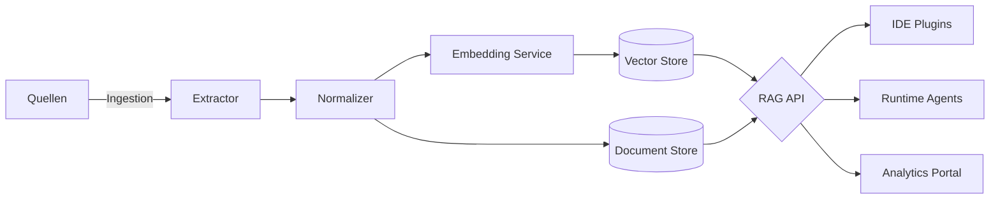

# RAG Operating Model für VALEO NeuroERP 3.0

## Ziele

- **Kontext-Hub** für Entwickler:innen, Produkt und Betrieb, um a.eins-Funktionsparität nachvollziehbar abzubilden.
- **Adaptive Assistenz**: KI-gestützte Features nutzen kontinuierlich aktualisierte Wissensinhalte für Empfehlungen, Validierungen und Automatisierung.
- **Governance**: Sicherstellen, dass vertrauliche Informationen kontrolliert versioniert, überprüft und gelöscht werden können.

## Inhaltsdomänen

1. **Produkt & Feature Mapping**
   - Vergleichstabellen a.eins ↔ NeuroERP (Module, Prozesse, KPIs).
   - Release Notes, Funktionsbeschreibungen, Lückenanalyse.
2. **Prozesswissen**
   - Ist-/Soll-Prozesse, BPMN-Diagramme, Playbooks, SLA-Definitionen.
3. **Technische Referenzen**
   - Architekturentscheidungen, Schnittstellenverträge, Datenmodelle.
4. **Compliance & Regulierung**
   - InfraStat-Meldewege, Zollkontrollen, GoBD/DSGVO-Anforderungen.
5. **Change-Learnings**
   - Post-Mortems, Feature-Retrospektiven, Lessons Learned.

## Pipeline-Architektur

- **Extractor**: Konnektoren für Markdown, Confluence, Tickets, Code, Datenbanken.
- **Normalizer**: Chunking (semantisch/struktur-basiert), Metadaten (Domain, Version, Sensitivität).
- **Embedding Service**: Modellwahl (z. B. OpenAI text-embedding-3-large oder lokale Alternativen).
- **Speicher**: Vektor-Datenbank (z. B. pgvector, Weaviate) + Dokumentenspeicher (S3/Blob).
- **API**: Einheitliche Retrieval-Schnittstelle mit Re-Ranking und Prompt Guardrails.
- **Konsumenten**: IDE-Erweiterung, ChatOps, Automations-Agents, QA-Assistent.

## Betriebsmodell

- **Kurationsprozess**
  - Contributors erstellen/aktualisieren Inhalte via Pull Requests.
  - Automatisierte Checks: Linting, TOC-Validierung, Sensitivitätstags.
  - Reviewer aus Domänen (Produkt, Compliance, Technik) pflegen Freigaben.
- **Versionierung**
  - Jede Wissenseinheit erhält Semantic Versioning und Lebenszyklusstatus (Draft, Review, Approved, Deprecated).
  - Historie wird archiviert; Embeddings erhalten Timestamps und Gültigkeit.
- **Sicherheit & Zugriff**
  - RBAC auf Collection-Ebene; sensitive Inhalte verschlüsselt.
  - Zugriff auf produktive RAG-APIs via Service Accounts und Audit-Logs.
- **Qualitätssicherung**
  - Re-Ranking Tests, Antwortqualität-Metriken (Precision@K, Deflection Rate).
  - Feedback aus Clients fließt zurück (Thumbs Up/Down, Missing Context).

## Implementierungsschritte

1. **Content-Audit**: Inventarisierung vorhandener Dokumente (docs/, ADRs, Runbooks, Compliance).
2. **Schema & Konventionen**: Definieren von Metadaten, Tags, Ordnerstruktur (`knowledge-base/<domäne>/<thema>.md`).
3. **Ingestion-Tooling**: Aufbau eines CLI/CI-Workflows zur Aktualisierung der Vektor-Datenbank (z. B. `tools/rag-sync`).
4. **RAG-Services**: Bereitstellung eines Microservices (`services/rag-gateway`) mit REST/GraphQL-Endpunkten.
5. **Dev-Erlebnis**: Integration in IDE über Cursor/VS Code Plugin, Bereitstellung von Prompt-Vorlagen.
6. **Monitoring**: KPI-Dashboard (z. B. Superset) für Nutzungs- und Qualitätsmetriken, Alerts bei Drift.

## Governance & Compliance

- **Retention**: Zeitliche Aufbewahrungsregeln, automatische Depublizierung veralteter oder sensibler Inhalte.
- **Legal Review**: Spezielle Freigabeprozesse für rechtlich relevante Dokumente (InfraStat, Zoll).
- **Ethik & Bias**: Regelmäßige Evaluation von Antworten, Bias-Tests, Rotlisten für unerwünschte Empfehlungen.
- **Audit-Trails**: Vollständige Protokollierung von Zugriffen und Änderungen; Integration in SIEM.

## Weiterer Ausbau

- Automatisierte Synchronisation mit Issue-Tracker (Jira/GitHub) für kontextbezogene Antworten.
- Personalisierte Retrieval-Profile (z. B. Rolle, Squad) zur besseren Relevanzsteuerung.
- Nutzung des RAG-Kontexts für generative Tests, Migrationsscripte und Change Simulationen.

